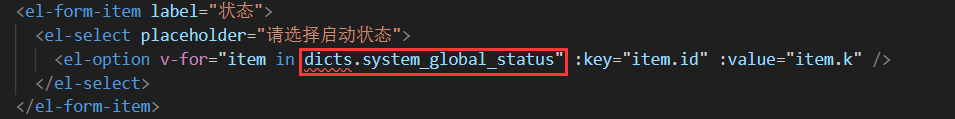
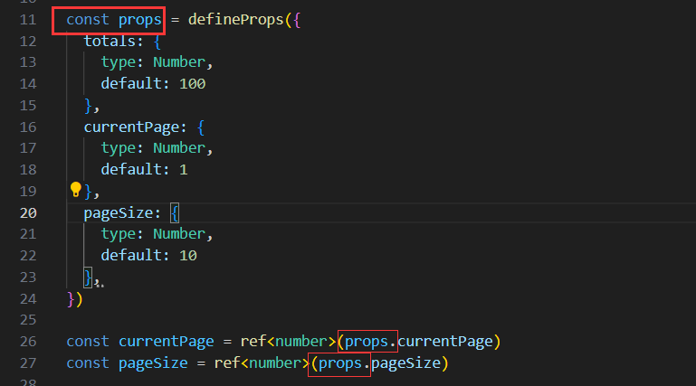
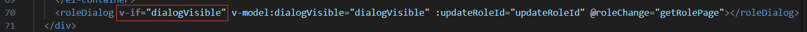
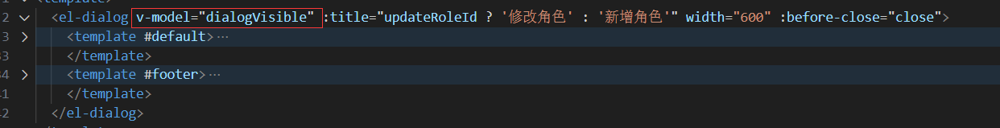
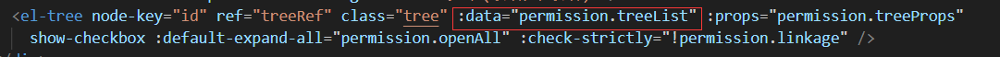
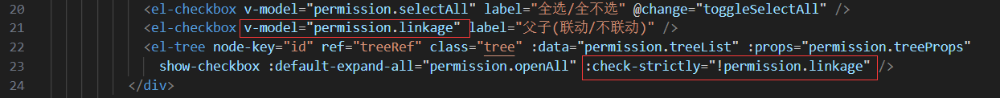
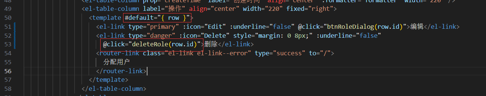
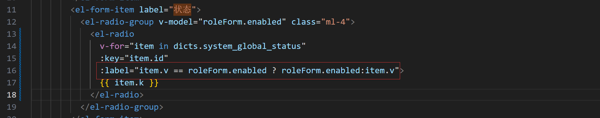
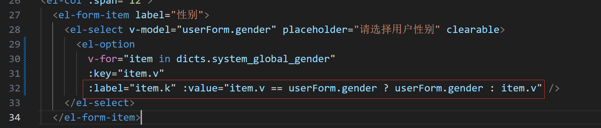

# 一 角色管理

1.1 布局

```
<template>
  <div>
    <el-container>
      <el-main>
        <el-tabs type="border-card">
          <el-tab-pane label="角色列表">
            <el-card class="card-container">
              <el-form>
                <el-row :gutter="15">
                  <el-col :span="8">
                    <el-form-item label="角色名称">
                      <el-input placeholder="请输入角色名称" />
                    </el-form-item>
                  </el-col>
                  <el-col :span="7">
                    <el-form-item label="角色编码">
                      <el-input placeholder="请输入角色编码" />
                    </el-form-item>
                  </el-col>
                  <el-col :span="9">
                    <el-form-item label="状态">
                      <el-select placeholder="请选择启动状态">
                        <el-option label="启用" />
                        <el-option label="禁用" />
                      </el-select>
                    </el-form-item>
                  </el-col>
                  <el-col :span="8">
                    <el-form-item>
                      <el-button type="primary" :icon="Search">搜索</el-button>
                      <el-button :icon="Refresh">重置</el-button>
                    </el-form-item>
                  </el-col>
                </el-row>
              </el-form>
            </el-card>
            <!-- 表格 -->
            <el-card>
              <div class="toolBar">
                <el-button type="primary" :icon="Plus">搜索</el-button>
              </div>
              <el-table :data="tableData" border style="width: 100%">
                <el-table-column type="selection" width="55" />
                <el-table-column prop="roleName" label="角色名称" align="center" />
                <el-table-column prop="rolePerm" label="权限字符" align="center" />
                <el-table-column label="是否启用" align="center">
                  <el-tag type="">是</el-tag>
                </el-table-column>
                <el-table-column prop="createTime" label="创建时间" align="center" :formatter="formatter" width="220" />
                <el-table-column label="操作" align="center" width="220" fixed="right">
                  <template #default="{ row }">
                    <el-link type="primary" :icon="Edit" :underline="false">编辑</el-link>
                    <el-link type="danger" :icon="Delete" style="margin: 0 8px;" :underline="false">删除</el-link>
                    <router-link class="el-link el-link--error" type="success" to="/">
                      分配用户
                    </router-link>
                  </template>
                </el-table-column>
              </el-table>
            </el-card>
          </el-tab-pane>
          <el-tab-pane label="Config">Config</el-tab-pane>
        </el-tabs>
      </el-main>
    </el-container>

  </div>
</template>
```

```
<style lang="scss" scoped>
.card-container {
  margin-bottom: 15px;
}

.toolBar {
  margin-bottom: 15px;
}
</style>
```

1.2 时间戳转换时间格式

```
const tool = {
  dateFormat:function(date,fmt='yyyy-MM-dd hh:mm:ss'){
    date = new Date(date);
    let o = {
      'M+': date.getMonth() + 1,//月份
      'd+': date.getDate(),     //日
      'h+': date.getHours(),    //小时
      'm+': date.getMinutes(),  //分
      's+': date.getSeconds(),  //秒
      'q+': Math.floor((date.getMonth()+3)/3),//季度
      'S' : date.getMilliseconds() //毫秒
    }
    if(/(y+)/.test(fmt)){
      fmt = fmt.replace( RegExp.$1, (date.getFullYear()+'').substr( 4 - RegExp.$1.length)  );
    }
    for( let k in o ){
      if( new RegExp("("+k+")").test(fmt)  ){
          fmt = fmt.replace( RegExp.$1 , (RegExp.$1.length == 1) ? (o[k]) : (("00"+o[k]).substr(("" + o[k]).length)));
      }
    }
    return fmt;
  }
}
export default tool;
```

# 二 字典

2.1 什么是后台管理系统的字典

```
字典管理主要用来维护和管理公用数据字典。
```

2.2 请求接口获取字典数据，且把字典数据全局混入。

- @mixins/DIctsPlugin.ts

  ```
  import {App,ref} from 'vue'
  import {queryBetch,Dicts} from '@api/dicts'
  export default function useDicts(app:App){
    const dicts = ref<Partial<Dicts>>({})
    //请求获取字典
    async function getDicts(params:string[]) {
      let res = await queryBetch(params)
      dicts.value = res.data
    }
    app.mixin({
      data(){
        return{
          dicts,
        }
      },
      methods:{
        run(){
          console.log('run')
        },
        getDicts
      }
    })
  }
  ```

- main.ts全局混入

  ```
  import useDicts from '@mixins/DIctsPlugin.ts'
  app.use(useDicts)
  ```

- 组件中调用全局混入的方法：

  - 获取全局组件：

    ```
    const { proxy } = getCurrentInstance() as ComponentInternalInstance
    ```

  - 执行混入方法：

    ```
    if (proxy) {
        (proxy as any).getDicts(['system_global_status', 'system_global_gender'])
      }
    ```

- 使用混入数据

  

2.3 解决全局混入数据出现红色波浪线：dicts出现红色波浪线


src/renderer/src/dicts.d.ts

```
export {}
interface Dicts{
  [key:string]:any;
}
declare module 'vue'{
  interface ComponentCustomProperties{
    dicts:Dicts
  }
}
```

# 三 搜索

搜索框绑定对应字段

```vue
<el-form>
                <el-row :gutter="15">
                  <el-col :span="8">
                    <el-form-item label="角色名称">
                      <el-input placeholder="请输入角色名称" v-model="ruleForm.roleName" />
                    </el-form-item>
                  </el-col>
                  <el-col :span="7">
                    <el-form-item label="角色编码">
                      <el-input placeholder="请输入角色编码" v-model="ruleForm.rolePerm" />
                    </el-form-item>
                  </el-col>
                  <el-col :span="9">
                    <el-form-item label="状态">
                      <el-select placeholder="请选择启动状态" v-model="ruleForm.enabled" clearable>
                        <el-option v-for="item in dicts.system_global_status" :key="item.id" :value="item.k" />
                      </el-select>
                    </el-form-item>
                  </el-col>
                  <el-col :span="8">
                    <el-form-item>
                      <el-button type="primary" :icon="Search" @click="getRolePage">搜索</el-button>
                      <el-button :icon="Refresh">重置</el-button>
                    </el-form-item>
                  </el-col>
                </el-row>
              </el-form>
```

搜索事件：

```
const getRolePage = async () => {
  let result = await rolePage(ruleForm)
  if (result.code == '200') {
    const { records, total } = result.data;
    tableData.value = records;
    totals.value = total
  }
}
```

重置事件：

```
//重置
const roleReset = () => {
  ruleForm.current = 1;
  ruleForm.size = 10;
  ruleForm.roleName = '';
  ruleForm.rolePerm = '';
  ruleForm.enabled = '';
  getRolePage()
}
```

注意：不能使用以下方法来改变`ruleForm`，因为`ruleForm`是由`reactive`定义的

```
ruleForm = {
    current: 1,
    size: 10,
    roleName: '',
    rolePerm: '',
    enabled: '',
}
```


# 四 全局组件

1.1 创建组件：src/renderer/src/pagination/index.vue

```vue
<template>
  <div class="demo-pagination-block">
    <el-pagination v-model:current-page="currentPage" v-model:page-size="pageSize" :page-sizes="[10, 30, 50, 100]"
      :disabled="disabled" layout="total, sizes, prev, pager, next, jumper" :total="totals"
      @size-change="handleSizeChange" @current-change="handleCurrentChange" />
  </div>
</template>
<script lang="ts" setup>
import { ref } from 'vue'

const props = defineProps({
  totals: {
    type: Number,
    default: 100
  },
  currentPage: {
    type: Number,
    default: 1
  },
  pageSize: {
    type: Number,
    default: 10
  },
})

const currentPage = ref<number>(props.currentPage)
const pageSize = ref<number>(props.pageSize)

const emit = defineEmits(['update:currentPage', 'update:pageSize'])
const handleSizeChange = (value) => {
  pageSize.value = value
  //触发父组件
  emit('update:pageSize', value)
}
const handleCurrentChange = (value) => {
  currentPage.value = value
  //触发父组件
  emit('update:currentPage', value)
}
</script>
<style lang="scss" scoped>
.demo-pagination-block {
  display: flex;
  justify-content: flex-end;
  padding: 10px 0;
}
</style>
```

1.2 注册组件

```
import pagination from '@components/pagination/index.vue'
app.component('pagination', pagination); 
```

1.3 引用子组件

```
<pagination @update:currentPage="handleCurrentPageUpdate" @update:pageSize="handlePageSizeUpdate"
                :totals="totals">
```

```
const handleCurrentPageUpdate = (val) => {
  ruleForm.current = val;
  getRolePage()
}
const handlePageSizeUpdate = (val) => {
  ruleForm.size = val;
  getRolePage()
}
```

1.4 子组件触发父组件方法且传递数据

```
const emit = defineEmits(['update:currentPage', 'update:pageSize'])
const handleSizeChange = (value) => {
  pageSize.value = value
  //触发父组件
  emit('update:pageSize', value)
}
const handleCurrentChange = (value) => {
  currentPage.value = value
  //触发父组件
  emit('update:currentPage', value)
}
```

1.5 子组件接收父组件数据

```js
const props = defineProps({
  totals: {
    type: Number,
    default: 100
  },
  currentPage: {
    type: Number,
    default: 1
  },
  pageSize: {
    type: Number,
    default: 10
  },
})

const currentPage = ref<number>(props.currentPage)
const pageSize = ref<number>(props.pageSize)
```

注意：如果在js里需要使用父组件传递的值，需要把数据赋值给对象。例如：



# 五 新增角色

窗口组件：

```vue
<template>
  <el-dialog v-model="dialogVisible" :title="updateRoleId ? '修改角色' : '新增角色'" width="600" :before-close="close">
    <template #default>
      <el-form :model="roleForm" label-width="80px">
        <el-form-item label="角色名称">
          <el-input v-model="roleForm.roleName" placeholder="请输入角色名称" />
        </el-form-item>
        <el-form-item label="权限字符">
          <el-input v-model="roleForm.rolePerm" placeholder="请输入权限字符" />
        </el-form-item>
        <el-form-item label="状态">
          <el-radio-group v-model="roleForm.enabled" class="ml-4">
            <el-radio v-for="item in dicts.system_global_status" :key="item.id" :label="item.v">{{ item.k }}</el-radio>
          </el-radio-group>
        </el-form-item>

        <el-form-item label="菜单权限">
          <div>
            <el-checkbox v-model="permission.openAll" label="展开/折叠" @change="toggleTreeCollapse" />
            <el-checkbox v-model="permission.selectAll" label="全选/全不选" @change="toggleSelectAll" />
            <el-checkbox v-model="permission.linkage" label="父子(联动/不联动)" />
            <el-tree node-key="id" ref="treeRef" class="tree" :data="permission.treeList" :props="permission.treeProps"
              show-checkbox :default-expand-all="permission.openAll" :check-strictly="!permission.linkage" />
          </div>
        </el-form-item>
        <el-form-item>

        </el-form-item>
        <el-form-item label="权限字符">
          <el-input v-model="roleForm.descript" type="textarea" maxlength="200" show-word-limit />
        </el-form-item>
      </el-form>
    </template>
    <template #footer>
      <span class="dialog-footer">
        <el-button @click="close">取消</el-button>
        <el-button type="primary" @click="onSubmit">
          确定
        </el-button>
      </span>
    </template>
  </el-dialog>
</template>
<script lang="ts" setup>
import { ref, reactive, getCurrentInstance, ComponentInternalInstance, onBeforeMount } from 'vue';
import { IRoleMenuItem, menuTree, roleAdd, roleGet, roleUpdate } from '@api/role.ts';
import { ElTree } from 'element-plus'
let props = defineProps({
  dialogVisible: {
    type: Boolean,
    default: false
  },
  updateRoleId: {
    type: String,
    default: ''
  }
})
let dialogVisible = ref(props.dialogVisible)
const emit = defineEmits();
//关闭弹窗
const close = () => {
  dialogVisible.value = false;
  emit('update:dialogVisible', false)
}
const update = async () => {
  await roleUpdate({
    id: updateRoleId.value,
    permissionIds: treeRef.value!.getCheckedKeys() as string[],
    ...roleForm,
  })
}
const add = async () => {
  await roleAdd({
    permissionIds: treeRef.value!.getCheckedKeys() as string[],
    ...roleForm,
  })
}
//弹窗：点击确定
const onSubmit = async () => {
  if (updateRoleId.value != '') {
    await update()
  } else {
    await add()
  }
  close()
  emit('roleChange')

}
//新增角色
//表单数据
const roleForm = reactive<{
  roleName: string;
  rolePerm: string;
  enabled: string;
  descript: string | undefined;
}>({
  roleName: "",//角色名称
  rolePerm: "",//角色权限编码
  enabled: '1',//是否启用（0：禁用；1：启用）
  descript: '',//描述
})

let updateRoleId = ref(props.updateRoleId)
//获取单选按钮选项
//获取字典
onBeforeMount(async () => {
  const { proxy } = getCurrentInstance() as ComponentInternalInstance
  if (proxy) {
    (proxy as any).getDicts(['system_global_status'])
  }
  //获取菜单权限
  let res = await menuTree()
  permission.treeList = res.data;
  //修改角色：先获取角色详情
  if (updateRoleId.value != '') {
    let res = await roleGet(updateRoleId.value)
    let { roleName, rolePerm, enabled, descript } = res.data.role;
    let { permissions } = res.data;
    roleForm.roleName = roleName
    roleForm.rolePerm = rolePerm
    roleForm.enabled = enabled
    roleForm.descript = descript?.toString();
    //设置已选中的节点
    treeRef.value?.setCheckedKeys(permissions)
  }
})

//菜单树
//菜单树
interface IPermission {
  treeList: IRoleMenuItem[];
  treeProps: {
    label: string;
  };
  linkage: boolean;
  openAll: boolean;
  selectAll: boolean;
}
let permission: IPermission = reactive({
  treeList: [],
  treeProps: {
    label: 'name'
  },
  linkage: true,
  openAll: false,
  selectAll: false
})

const treeRef = ref<InstanceType<typeof ElTree>>()
//全选/全不选
const toggleSelectAll = (e) => {
  //方法一
  /* if (e) {
    treeRef.value?.setCheckedKeys(permission.treeList.map((item: { id: any }) => item.id));
  } else {
    treeRef.value?.setCheckedKeys([]);
  } */
  //方法二
  let nodeMap = treeRef.value!.store.nodesMap;
  Object.keys(nodeMap).forEach(key => {
    nodeMap[key].checked = e;
  })
}
//展开/折叠
const toggleTreeCollapse = (e) => {
  Object.values(treeRef.value!.store.nodesMap).forEach((v) => {
    v.expanded = e
  })
}
</script>
<style lang="scss" scoped>
.tree {
  margin-top: 0.5rem;
  background-color: #fff;
  border: 1px solid #dcdfe6;
  border-radius: 4px;
}
</style>
```

思路：点击按钮新增弹窗，弹窗填写新增角色详情，请求获取菜单权限树。弹窗点击确定新增角色且关闭弹窗，弹窗点击x或者取消不新增且关闭弹窗。

- 点击新增按钮，显示弹窗

  父组件：

  

  ```js
  <el-button type="primary" :icon="Plus" @click="btnRoleDialog">新增</el-button>
  ```

  ```js
  //弹窗
  let dialogVisible = ref<boolean>(false)
  //添加/修改角色
  const updateRoleId = ref('')
  const btnRoleDialog = (id) => {
    if(typeof id == 'string'){
      updateRoleId.value = id
    }else{
      updateRoleId.value = ''
    }
    dialogVisible.value = true;
  }
  ```

  子组件：

  ```js
  let props = defineProps({
    dialogVisible: {
      type: Boolean,
      default: false
    },
    updateRoleId: {
      type: String,
      default: ''
    }
  })
  let dialogVisible = ref(props.dialogVisible)
  const emit = defineEmits();
  ```

  

- 获取菜单权限树

  ```js
  //获取单选按钮选项
  //获取字典
  onBeforeMount(async () => {
    const { proxy } = getCurrentInstance() as ComponentInternalInstance
    if (proxy) {
      (proxy as any).getDicts(['system_global_status'])
    }
    //获取菜单权限
    let res = await menuTree()
    permission.treeList = res.data;
  })
  ```

  

  接口：

  ```js
  //获取菜单权限树
  export const menuTree = ():Promise<IRole> => {
    return http.get<IRole>('/system/menu/tree')
  }
  ```

- 菜单树

  - 菜单树展示：

    ```js
            <el-form-item label="菜单权限">
              <div>
                <el-checkbox v-model="permission.openAll" label="展开/折叠" @change="toggleTreeCollapse" />
                <el-checkbox v-model="permission.selectAll" label="全选/全不选" @change="toggleSelectAll" />
                <el-checkbox v-model="permission.linkage" label="父子(联动/不联动)" />
                <el-tree node-key="id" ref="treeRef" class="tree" :data="permission.treeList" :props="permission.treeProps"
                  show-checkbox :default-expand-all="permission.openAll" :check-strictly="!permission.linkage" />
              </div>
            </el-form-item>
    ```

    ```js
    //菜单树
    interface IPermission {
      treeList: IRoleMenuItem[];
      treeProps: {
        label: string;
      };
      linkage: boolean;
      openAll: boolean;
      selectAll: boolean;
    }
    let permission: IPermission = reactive({
      treeList: [],
      treeProps: {
        label: 'name'
      },
      linkage: true,
      openAll: false,
      selectAll: false
    })
    
    const treeRef = ref<InstanceType<typeof ElTree>>()
    ```

  - 全选/全不选

    ```js
    const toggleSelectAll = (e) => {
      //方法一
      /* if (e) {
        treeRef.value?.setCheckedKeys(permission.treeList.map((item: { id: any }) => item.id));
      } else {
        treeRef.value?.setCheckedKeys([]);
      } */
      //方法二
      let nodeMap = treeRef.value!.store.nodesMap;
      Object.keys(nodeMap).forEach(key => {
        nodeMap[key].checked = e;
      })
    }
    ```

  - 展开/折叠

    ```js
    //展开/折叠
    const toggleTreeCollapse = (e) => {
      Object.values(treeRef.value!.store.nodesMap).forEach((v) => {
        v.expanded = e
      })
    }
    ```

  - 父子(联动/不联动)

    

- 添加

  ```js
  const add = async () => {
    await roleAdd({
      permissionIds: treeRef.value!.getCheckedKeys() as string[],
      ...roleForm,
    })
  }
  //弹窗：点击确定
  const onSubmit = async () => {
    if (updateRoleId.value != '') {
      await update()
    } else {
      await add()
    }
    close()
    emit('roleChange')
  
  }
  ```

  接口：

  ```js
  //添加角色
  export const roleAdd = (data:IroleData):Promise<IroleAdd> => {
    return http.post<IroleAdd>('/system/role/add',data)
  }
  ```

# 六 删除角色



```js
//删除角色
const deleteRole = (id) => {
  ElMessageBox.confirm(
    '是否删除?',
    '确认',
    {
      confirmButtonText: '确定',
      cancelButtonText: '取消',
      type: 'warning',
    }
  )
    .then(async () => {
      let result = await roleDelete(id)
      if (result.code == '200') {
        getRolePage();
      }


    })
    .catch(() => {
      ElMessage({
        type: 'info',
        message: '取消删除',
      })
    })

}
```

# 七 修改角色

思路：点击修改按钮，传递该角色id。显示弹窗，弹窗根据角色id显示弹窗title和请求该角色详情。菜单权限树勾选`获取的角色详情的菜单树`，点击确定修改角色

- 显示弹窗：

  父组件：

  ```vue
  <el-link type="primary" :icon="Edit" :underline="false" @click="btnRoleDialog(row.id)">编辑</el-link>
  ```

  ```js
  //添加/修改角色
  const updateRoleId = ref('')
  const btnRoleDialog = (id) => {
    if(typeof id == 'string'){
      updateRoleId.value = id
    }else{
      updateRoleId.value = ''
    }
    dialogVisible.value = true;
  }
  ```

- 获取角色详情

  ```js
  onBeforeMount(async () => {
    //修改角色：先获取角色详情
    if (updateRoleId.value != '') {
      let res = await roleGet(updateRoleId.value)
      let { roleName, rolePerm, enabled, descript } = res.data.role;
      let { permissions } = res.data;
      roleForm.roleName = roleName
      roleForm.rolePerm = rolePerm
      roleForm.enabled = enabled
      roleForm.descript = descript?.toString();
      //设置已选中的节点
      treeRef.value?.setCheckedKeys(permissions)
    }
  })
  ```

  接口：

  ```js
  //获取角色详情 
  export const roleGet = (data:string):Promise<IroleUpdate> => {
    return http.get<IroleUpdate>(`/system/role/get/${data}`)
  }
  ```

- 修改角色：

  ```js
  //弹窗：点击确定
  const onSubmit = async () => {
    if (updateRoleId.value != '') {
      await update()
    } else {
      await add()
    }
    close()
    emit('roleChange')
  
  }
  const update = async () => {
    await roleUpdate({
      id: updateRoleId.value,
      permissionIds: treeRef.value!.getCheckedKeys() as string[],
      ...roleForm,
    })
  }
  ```

  接口：

  ```js
  //修改角色
  export const roleUpdate = (data:IroleData):Promise<IroleAdd> => {
    return http.post<IroleAdd>(`/system/role/update`,data)
  }
  ```

# 八 项目的权限控制

1.1 左侧菜单权限

```
1. 用户进行登录，登录成功，后端会给前端返回用户的“TOKEN”
2. 接着请求【个人信息】接口，把token传递过去（header），获取到了用户的信息内容，其中控制左侧菜单权限的字段是：【角色权限编码】
3. 接着请求【获取路由】接口，把【角色权限编码】内容专递给后端，从而获得当前登录的用户的权限树（路由树：菜单数据）。
4. 前端把数据（可能需要进行重构），渲染到页面上即可。
```

1.2 按钮级权限控制

```
1. 在登录的时候，会请求【个人信息】接口，其中返回的数据中，有一个【权限信息】数据。
2. 接着，我们写一个自定义指令文件，去判断：如果【权限信息】是（"*:*:*"）则代表是最高权限，无需判断任何内容了。
3. 如果【权限信息】不是（"*:*:*"），那么就要判断，【权限信息】所有数据在自定义指令绑定的value值中，是否存在，如果不存在，那么就把对应的dom节点删除掉：父节点.removeChild(子节点)
```

1.3 删除节点：自定义指令

自定义指令：

```ts
import {useUserStore} from '@store/useUserStore'

export const AuthDirective = {
  name:'auths',
  mounted(el:any,binding:any) {
    let permissions= useUserStore().permissions;
    // 判断用户权限是否包含该权限
    if(permissions.includes("*:*:*")) return
    if(!permissions.includes(binding.value)){
      const parent = el.parentElement;
      parent && parent.removeChild(el);
    }
  },
}
```

全局引入：

```js
//自定义指令
import {AuthDirective} from './directives/auths.directives'
app.directive(AuthDirective.name,AuthDirective);
```

使用：

```
v-auths="'auths'";//单引号里代表binding.value
```

# 九 修改用户/角色弹窗

1. 使用接口获取用户/角色详情，获取到的`gender、enabled`是数字，要在弹窗里显示对应的值，需修改：

   

   
