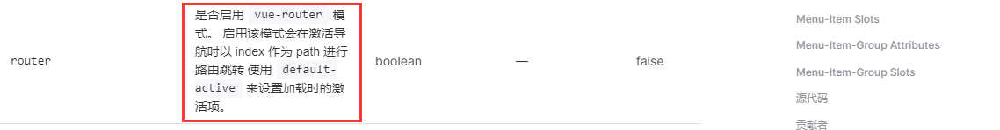
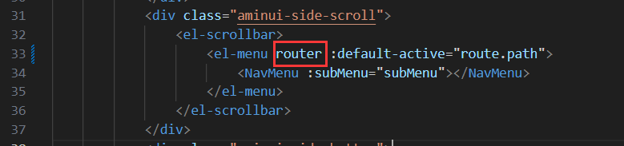
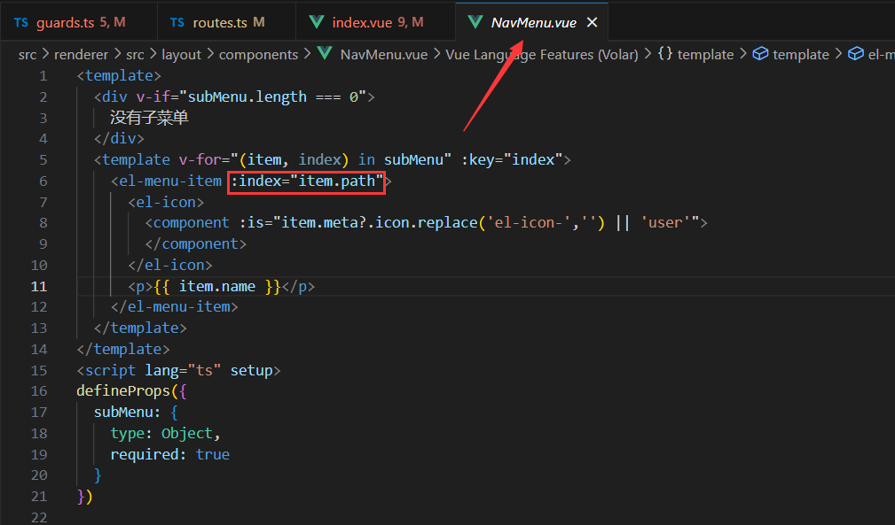
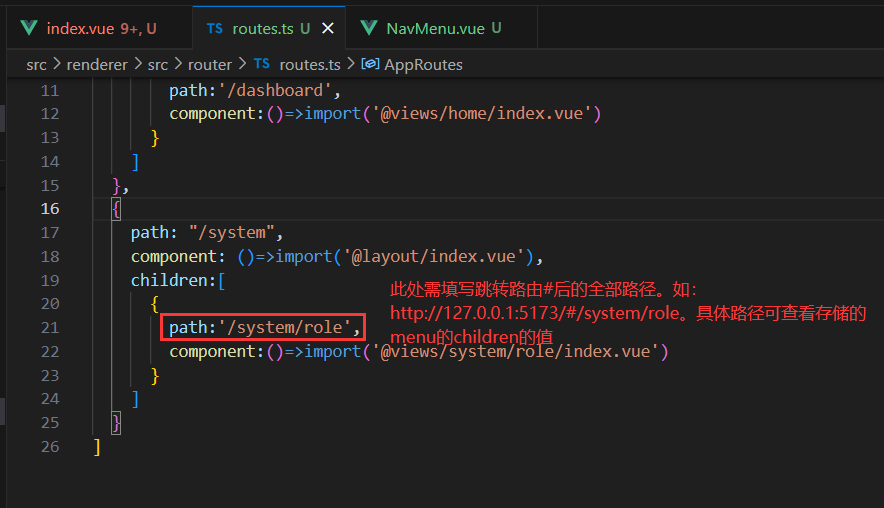
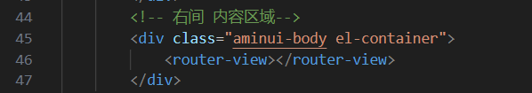
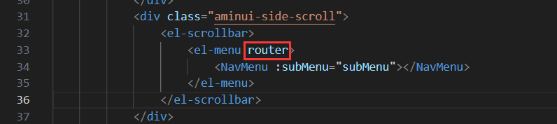
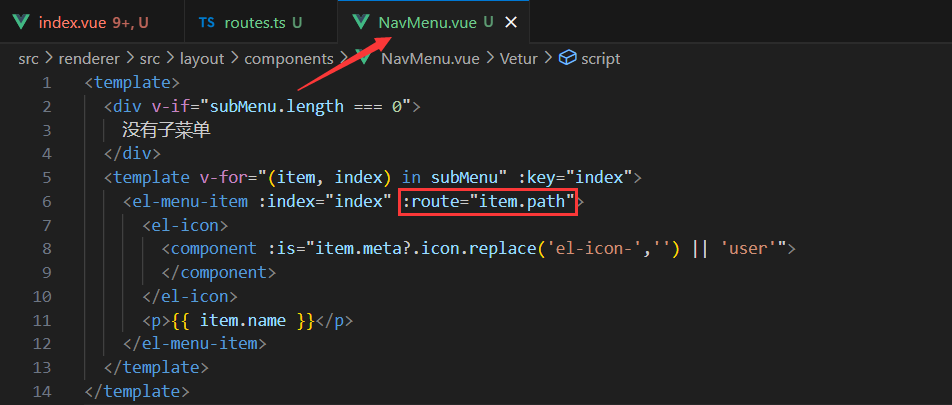
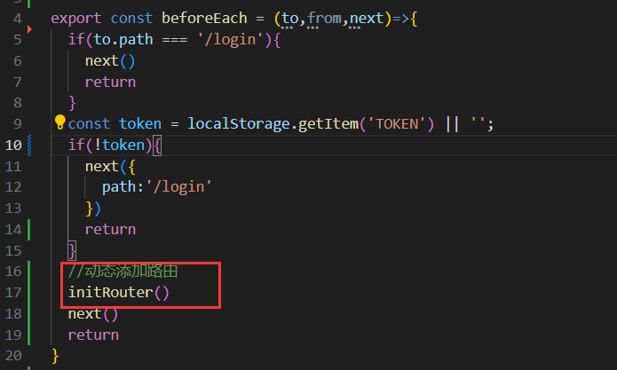
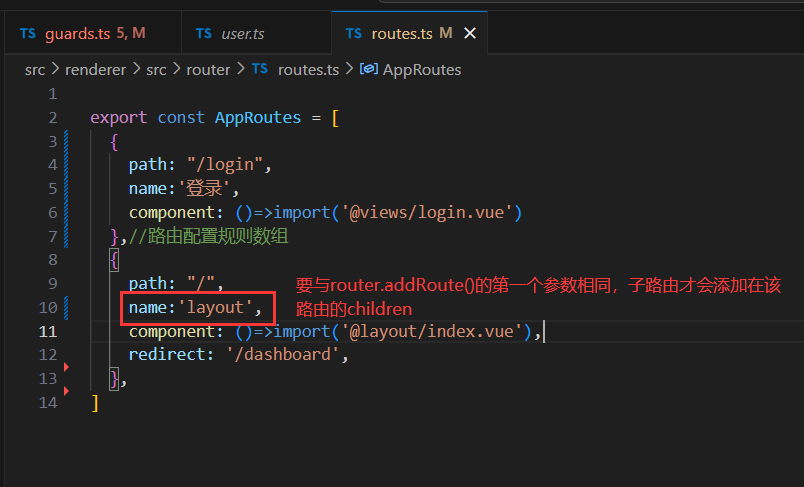

# 一、electron本身开发模式

## 1.1 npm init -y


  ***生成一个package.json


## 1.2 安装electron


  npm install electron --save-dev


  ***最好采用国内镜像


## 1.3 项目的根目录新建一个index.js


  const { app, BrowserWindow } = require('electron')


  const createWindow = () => {

​    const win = new BrowserWindow({

​      width: 800,

​      height: 600

​    })


​    win.loadFile('index.html')

  }


  app.whenReady().then(() => {

​    createWindow()

  })


## 1.4 启动项目==》设置命令 [package.json]


```
  "scripts": {

​      "start": "electron .",

​      "test": "echo \"Error: no test specified\" && exit 1"

​    },
```


## 1.5 启动项目


   npm run start


## 1.6 项目根目录新建一个index.html


# 二、我们的开发模式：electron + vite + vue3 


## 2.1 参考网址： https://evite.netlify.app/ 


## 2.2 安装步骤


  npx degit alex8088/electron-vite-boilerplate electron-app

  cd electron-app


  npm install

  npm run dev


# 三、安装路由


## 3.1 安装路由：npm install vue-router -S


## 3.2 新建：router/index.js


## 3.3router/index.js写入内容


```
  import { createRouter, createWebHashHistory } from "vue-router";

  export default createRouter({

   history: createWebHashHistory(),//hash模式

      routes:[{ path: "/", component: Login }]//路由配置规则数组

  })
```


## 3.4 main.ts中use一下router


  use(router)

# 四、electron-app项目，目录结构说明


 build ==》打包操作，例如：打包后的应用图标，.env环境变量的配置等等

 resources ==〉资料目录，例如：放入图片，有点类似于vue-cli中的publick目录

 src

  |main      ==>操作主进程内容，例如：创建窗口等

  |preload   ==>预加载，本身渲染进程是不可以使用electron等api的，通过preload预加载就可以使用了。

  |renderer  ==>操作渲染进程，就是应用中的内容。


 electron.vite.config.ts  ==》这个和vue中的vite.config.js ｜｜ vue.config.js类似


 ***其他目录文件随着课程的更新，会不断给大家讲述，包括打包项目时我们还会新增很多文件。


# 五、下载pinia 


## 5.1 官网：https://pinia.web3doc.top/


## 5.2  下载：npm install pinia -S


## 5.3 main.ts引入


```
  import { createPinia } from 'pinia'

  app.use(createPinia())
```


## 5.4 新建目录：store/index.js


```
  import { defineStore } from 'pinia'


  export const useStore = defineStore('storeId', {

​    state: () => {

​      return {

​        counter: 0,

​      }

​    },

​    getters:{},

​    actions:{}

  })
```


***关于pinia的二次封装和持久化存储，后续会讲述

## 5.5 持久化存储

安装：`cnpm install pinia-plugin-persist`

`main.ts`引入：

```
import { createPinia, defineStore } from "pinia";
import piniaPluginPersist from 'pinia-plugin-persist'
 
const store = createPinia()
store.use(piniaPluginPersist)
app.use(store)
```

`store/index.js`

```
import { defineStore } from 'pinia'

export const useStore = defineStore('storeId', {
  state: () => {
    return {
      counter: 0,
    }
  },
  getters: {},
  actions: {},
  persist: {
    enabled: true,
    strategies: [
      {
        storage: localStorage,//表示存储在localStorage
        paths:['counter']
      }
    ]
  }
})
```

使用：

```

```


# 六 配置代理和请求二次安装

安装：`cnpm install axios`

封装请求文件：

```
import axios from "axios";


const request = axios.create({
  baseURL: '/api'
});
// 添加请求拦截器
request.interceptors.request.use(function (config) {
  // 在发送请求之前做些什么
  return config;
}, function (error) {
  // 对请求错误做些什么
  return Promise.reject(error);
});

// 添加响应拦截器
request.interceptors.response.use(function (response) {
  // 对响应数据做点什么
  return response;
}, function (error) {
  // 对响应错误做点什么
  return Promise.reject(error);
});
```

`electron.vite.config.ts`

```
devServer:{
    proxy:{
      //简写
      '/api':{
        target:"http://uat.crm.xuexiluxian.cn",
        changeOrigin:true,
        rewrite:path => path.replace(/^\/api/,'')
      }
    }
  }
```

# 七 安装Element Plus

1 安装：`cnpm install element-plus --save`

element plus按需导入：

安装插件：`cnpm install -D unplugin-vue-components unplugin-auto-import`

electron.vite.config.js：

```
import AutoImport from 'unplugin-auto-import/vite'
import Components from 'unplugin-vue-components/vite'
import { ElementPlusResolver } from 'unplugin-vue-components/resolvers'

export default defineConfig({
  
  
  renderer: {
    
    plugins: [
      vue(),
      AutoImport({
        resolvers: [ElementPlusResolver()],
      }),
      Components({
        resolvers: [ElementPlusResolver()],
      }),
    ],
    
  }, 

})
```

2 安装icon图标：`cnpm install @element-plus/icons-vue`

全局导入：`main.ts`

```
import * as ElementPlusIconsVue from '@element-plus/icons-vue'

const app = createApp(App)
for (const [key, component] of Object.entries(ElementPlusIconsVue)) {
  app.component(key, component)
}
```

# 八 登陆布局&账号密码登陆功能


# 九 手机号码登陆


# 十 登陆页无边框窗口

1. 登陆页隐藏上方的electron（标题）

   在主进程里添加：`titleBarStyle:'hidden '`

   **出现问题**：窗口无法拖拽。

   解决：在渲染进程添加样式：`-webkit-app-region: drag;`但是也有个致命的问题：**设置了这个样式的元素几乎无法响应所有的鼠标事件，包括点击、拖拽等。**

2. 登陆页上方存在一个区域，该区域存放三个按钮，分别是放大、最小化、关闭窗口。该区域称为标题栏。隐藏标题栏：主进程里添加

   `frame:false`

3. 无边框窗口可以实现拖拽：

   在登陆页面添加事件`@mousedown=mousedown`

   ```
   const mousedown = (event) => {
   	dragging.value = true;
       mouseX.value = event.x;
       mouseY.value = event.y;
       document.onmousemove = (e) => {
       	if (dragging.value) {
               const x = e.screenX - mouseX.value
               const y = e.screenY - mouseY.value
               let data = {
                   appX:x,
                   appY:y
               }
               electron.ipcRenderer.invoke('custom-adsorption',data)
           }
       }
       document.onmouseup = () => {
       	dragging.value = false;
       }
   }
   ```

   主进程接收事件：

   ```
   ipcMain.handle('custom-adsorption',(event,res)=>{
   	let x = res.appX;
   	let y = res.appY;
   	mainWindow.setPosition(x,y)
   })
   ```

4. 设置窗口固定大小：`resizable:false;`

   解决问题：主进程设置`resizable:false;frame:false`后，拖拽窗口，窗口会自动变大。

   原因：

   

   或者：

   ```js
   app.commandLine.appendSwitch('high-dpi-support', 1);
   app.commandLine.appendSwitch('force-device-scale-factor', 1);
   ```

5. 拓展：创建一个子窗口，且仅可创建一个子窗口，子窗口实现锁定（固定位置）/解锁，关闭功能。重复点击创建子窗口，实现创建/关闭。

   - 创建子窗口

     渲染进程点击按钮触发主进程：

     ```
     <button @click="newList">歌词</button>
     const newList = () => {
       electron.ipcRenderer.invoke('new-list')
     }
     ```

     主进程判断是否有子窗口，**避免重复创建子窗口**

     ```js
       //创建子窗口
       ipcMain.handle('new-list',(event,res)=>{
         //当子窗口存在时，关闭窗口
         //当子窗口不存在时，创建窗口
         console.log('点击歌词')
         console.log(context.listWindow)
         if(context.listWindow != null){
           hideWindow()
         }else{
           createListWindow()
         }
       })
     
       
         //创建子窗口
       const createListWindow = () => {
         //创建
         context.listWindow = new BrowserWindow({
           width: 400,
           height: 100,
           show: false,
           titleBarStyle:'hidden',
           resizable:false,
           autoHideMenuBar: true,
           ...(process.platform === 'linux' ? { icon } : {}),
           webPreferences: {
             preload: join(__dirname, '../preload/index.js'),
             sandbox: false
           }
         })
         //显示
         context.listWindow.on('ready-to-show', () => {
           context.listWindow.show()
         })
         context.isShow = true;
         //关闭窗口
         context.listWindow.on('close', () => {
           //如果主进程退出，则销毁子窗口；如果主进程没有退出，则隐藏子窗口
           if(context.allowQuitting){
             context.listWindow = null;
           }else{
             hideWindow()
           }
         })
         //对应的页面
         if (is.dev && process.env['ELECTRON_RENDERER_URL']) {
           context.listWindow.loadURL(process.env['ELECTRON_RENDERER_URL']+'/#/list')
         } else {
           context.listWindow.loadFile(join(__dirname, '../renderer/index.html'))
         }
       }
     ```

     存在问题：首次点击按钮，此时`context.listWindow==null` ,成功走到创建窗口，再次点击按钮，此时`context.listWindow`是：

     ```
     BrowserWindow {
       setBounds: [Function (anonymous)],
       _events: [Object: null prototype] {
         blur: [Function (anonymous)],
         focus: [Function (anonymous)],
         show: [Function: visibilityChanged],
         hide: [Function: visibilityChanged],
         minimize: [Function: visibilityChanged],
         maximize: [Function: visibilityChanged],
         restore: [Function: visibilityChanged],
         'ready-to-show': [Function (anonymous)],
         close: [Function (anonymous)]
       },
       _eventsCount: 9,
       devToolsWebContents: [Getter]
     }
     ```

     则成功走到隐藏窗口。**但是当再次点击按钮时，此时`context.listWindow!==null`，仍然是：**

     ```
     BrowserWindow {
       setBounds: [Function (anonymous)],
       _events: [Object: null prototype] {
         blur: [Function (anonymous)],
         focus: [Function (anonymous)],
         show: [Function: visibilityChanged],
         hide: [Function: visibilityChanged],
         minimize: [Function: visibilityChanged],
         maximize: [Function: visibilityChanged],
         restore: [Function: visibilityChanged],
         'ready-to-show': [Function (anonymous)],
         close: [Function (anonymous)]
       },
       _eventsCount: 9,
       devToolsWebContents: [Getter]
     }
     ```

     所以还是走到了隐藏窗口。代码无法按预期实现，修改为：

     ```
       //创建子窗口
       ipcMain.handle('new-list',(event,res)=>{
         //首次点击按钮：创建窗口
         //再次点击按钮：根据‘context.isShow’判断是否显示，true就隐藏窗口，false就显示窗口
         if(context.listWindow === null){
           createListWindow()
         }else{
           if(context.isShow){
             hideWindow()
           }else{
             showWindow()
           }
         }
       })
     ```

     **子窗口y轴位置靠下：**

     ```
        import { app, shell, BrowserWindow,ipcMain,screen } from 'electron'
        //显示
         context.listWindow.on('ready-to-show', () => {
           let winHeight = screen.getPrimaryDisplay().bounds.height;
           context.listWindow.setBounds({
             y:winHeight-200
           })
           context.listWindow.show()
         })
     ```

     [electron](https://so.csdn.net/so/search?q=electron&spm=1001.2101.3001.7020)中screen模块：`screen.getPrimaryDisplay()`返回主窗口Display对象。

     ```
     console.log(screen.getPrimaryDisplay().bounds) // { x: 0, y: 0, width: 1920, height: 1080 }，获取页面的信息，height是整个窗口的高度
     ```

     置顶窗口：`alwaysOnTop:true`

     ```
         context.listWindow = new BrowserWindow({
           width: 400,
           height: 100,
           show: false,
           frame:false,
           resizable:false,
           autoHideMenuBar: true,
           alwaysOnTop:true,//置顶窗口
           transparent:true,//透明窗口
           ...(process.platform === 'linux' ? { icon } : {}),
           webPreferences: {
             preload: join(__dirname, '../preload/index.js'),
             sandbox: false
           }
         })
     ```

     子窗口实现拖拽：

     ```
     @mousedown="mousedown"
     
     import { ref } from 'vue'
     let dragging = ref<boolean>(false)
     let mouseX = ref<number>(0)
     let mouseY = ref<number>(0)
     const mousedown = (event) => {
       dragging.value = true;
       mouseX.value = event.x;
       mouseY.value = event.y;
       document.onmousemove = (e) => {
         if (dragging.value) {
           const x = e.screenX - mouseX.value
           const y = e.screenY - mouseY.value
           let data = {
             appX: x,
             appY: y
           }
           electron.ipcRenderer.invoke('list-adsorption', data)
         }
       }
       document.onmouseup = () => {
         dragging.value = false;
       }
     }
     ```

     **子窗口透明：**

     ```
     context.listWindow = new BrowserWindow({
           width: 400,
           height: 100,
           show: false,
           titleBarStyle:'hidden',
           resizable:false,
           autoHideMenuBar: true,
           alwaysOnTop:true,//置顶窗口
           transparent:true,//透明窗口
           ...(process.platform === 'linux' ? { icon } : {}),
           webPreferences: {
             preload: join(__dirname, '../preload/index.js'),
             sandbox: false
           }
         })
     ```

     **窗口锁定：**

     渲染进程：

     ```
     @click="kiosk"
     const kiosk = () => {
       electron.ipcRenderer.invoke('list-kiosk')
     }
     ```

     主进程：

     ```
       //锁定窗口
       ipcMain.handle('list-kiosk',(event)=>{
         if(context.listWindow.kiosk){
           context.listWindow.setKiosk(false)
         }else{
           context.listWindow.setKiosk(true)
         }
       })
     ```

     出现问题：锁定后的子窗口，会跳到电脑窗口的左上方。就算按照上方设定y轴靠下设置位置也无效。

     解决问题：主进程设置值isKiosk，为true时窗口锁定（拖拽时窗口不动）；为false时窗口解锁（拖拽时窗口进行移动）

     渲染进程：

     ```
     <span @click="kiosk">锁定/解锁</span>
     
     let isKiosk = ref<boolean>(false)
     const kiosk = () => {
       isKiosk.value = !isKiosk.value
       electron.ipcRenderer.invoke('list-kiosk', { isKiosk: isKiosk.value })
     }
     ```

     主进程：

     ```
       let isKiosk = false;
       //拖拽子窗口
       ipcMain.handle('list-adsorption',(event,res)=>{
         if(!isKiosk){
           context.listWindow.setPosition(res.appX,res.appY)
         }
       })
     
       //锁定窗口
       ipcMain.handle('list-kiosk',(event,res)=>{
         isKiosk = res.isKiosk
       })
     ```

     **窗口锁定时关闭按钮隐藏：**

     ```
     <button @click="close" :class="isKiosk ? 'off' : ''">关闭</button>
     .off {
       visibility: hidden;
     }
     ```

     **关闭子窗口：**

     渲染进程：

     ```
     const close = () => {
       electron.ipcRenderer.invoke('list-close')
     }
     
     ```

     主进程：

     ```
       //关闭子窗口
       ipcMain.handle('list-close',()=>{
         hideWindow()
       })
     
     ```

     **子窗口鼠标悬浮添加背景色，锁定子窗口时无论鼠标有没有悬浮都不给背景色：**

     ```
     let hoverColor = ref<string>('rgba(0,0,0,.5)')
     
     let isKiosk = ref<boolean>(false)
     const kiosk = () => {
       isKiosk.value = !isKiosk.value
       if (!isKiosk.value) {
         hoverColor.value = 'rgba(0,0,0,.5)'
       } else {
         hoverColor.value = ''
       }
       electron.ipcRenderer.invoke('list-kiosk', { isKiosk: isKiosk.value })
     }
     
     ```

     ```
     <div class="list" @mousedown="mousedown" :style="{ '--hover-color': hoverColor }">
     
     .list:hover {
       background-color: var(--hover-color);
     }
     
     ```

     频繁点击子窗口切换(显示/隐藏)，显示子窗口时会出现窗口抖动：

     ```
     app.commandLine.appendSwitch('wm-window-animations-disabled');
     
     ```

# 十一 登录页添加关闭/换肤/语言按钮


1. 关闭按钮

   ```
     //窗口关闭
     ipcMain.handle('closeWindow',()=>{
       mainWindow.close();
     })
   
   ```

2. 暗黑模式

   切换显示不同按钮。

   ```
   <el-button circle @click="configDark">
             <el-icon v-if="dark">
               <Sunny />
             </el-icon>
             <el-icon v-else>
               <Moon />
             </el-icon>
           </el-button>
   
   ```

   显示暗黑模式：

   ```
   //main.ts
   import 'element-plus/theme-chalk/src/dark/css-vars.scss'
   
   ```

   ```
   //assets/style.scss
   * {
     margin: 0;
     padding: 0;
   }
   
   a {
     text-decoration: none;
   }
   
   html.dark {
     /* 自定义深色背景颜色 */
     --el-bg-color: #626aef;
   
     .login {
       background: var(--el-bg-color);
   
       a {
         color: #fff;
       }
     }
   
   }
   
   
   ```

   ```
   //login.vue
   let dark = ref<string | null>(localStorage.getItem('dark'))
   //换肤
   const configDark = () => {
     const element = document.querySelector('html') as HTMLElement | null;
     if (element) {
       if (dark.value) {
         element.className = ''
       } else {
         element.className = 'dark'
       }
       dark.value = element.className
       localStorage.setItem('dark', element.className)
     }
   }
   
   ```


```
   const configDark = () => {
       const element = document.querySelector('html') as HTMLElement | null;
       if(element){
           element.className = 'dark'
       }
   }

```

   关闭窗口后再打开显示上一次的模式

```
   //App.vue
   import { ref, onBeforeMount } from 'vue';
   let dark = ref<string | null>(localStorage.getItem('dark'))
   onBeforeMount(() => {
     const element = document.querySelector('html') as HTMLElement | null;
     if (element) {
       if (dark.value) {
         element.className = 'dark'
       } else {
         element.className = ''
       }
     }
   })

```

1. 解决红色波浪线，如下图所示：

   

2. 解决函数里没使用的参数出现下划线问题：

   

   

# 十二 国际化

1. 安装插件：`cnpm i vue-i18n`

2. local/index.ts，

   - 在src目录下，创建 local 文件夹，并在下面分别创建三个文件 分别为 ：

   - ① index.js => 主文件用于导入 i18n ，和相关配置

     ```
     import { createI18n } from 'vue-i18n';
     import ZH from './lang/zh.js';
     import EN from './lang/en.js';
     
     import zhCn from 'element-plus/dist/locale/zh-cn.mjs'
     import English from 'element-plus/dist/locale/en.mjs'
     const messages = {
       'zh-cn': { el: zhCn, ...ZH  },
       'en': { el: English, ...EN  },
     };
      
     const i18n = createI18n({
       locale: localStroage.getItem('lang') || 'zh-cn',
       messages
     });
     
     export default i18n;
     
     ```

   - ② lang/zh.ts => 存放中文内容

     ```
     export default{
       login: {
         name:'小鹿线',
     		slogan: '客户关系管理系统',
     		describe: '让业务在线更高效，加速企业数字化升级。',
         version:' © 小鹿线客户管理系统 1.0.11',
     		title:'小鹿线客户管理系统',
     		signInTitle: '用户登录',
     		accountLogin: '账号登录',
     		mobileLogin: '手机号登录',
     		rememberMe: '记住密码',
     		forgetPassword: '忘记密码',
     		signIn: '登录',
     		signInOther: '其他登录方式',
     		userPlaceholder: '用户名 / 手机 / 邮箱',
     		userError: '请输入账号',
     		PWPlaceholder: '请输入密码',
     		PWError: '请输入密码',
     		admin: '管理员',
     		user: '用户',
     		mobilePlaceholder: '手机号码',
     		mobileError: '请输入手机号码',
     		mobileFormat:'请输入正确的手机号码',
     		smsPlaceholder: '短信验证码',
     		smsError: '请输入短信验证码',
     		smsGet: '获取验证码',
     		smsSent: '已发送短信至手机号码',
     		noAccount: '还没有账号?',
     		createAccount: '创建新账号',
     		wechatLoginTitle: '二维码登录',
     		wechatLoginMsg: '请使用微信扫一扫登录 | 模拟3秒后自动扫描',
     		wechatLoginResult: '已扫描 | 请在设备中点击授权登录'
     	},
     	user: {
     		dynamic: '近期动态',
     		info: '个人信息',
     		settings: '设置',
     		nightmode: '黑夜模式',
     		nightmode_msg: '适合光线较弱的环境，当前黑暗模式为beta版本',
     		language: '语言',
     		language_msg: '翻译进行中，暂翻译了本视图的文本',
     	}
     }
     
     ```

   - ③ lang/en.ts => 存放英文内容

     ```
     export default{
       login: {
         name:'xiao lu xian',
     		title:'Xiaolu Line Customer Management System',
     		slogan: 'The most concise basic permission framework system.' ,
     		describe: 'Electron + Vue3 + element plus based front-end solutions in the background.',
         version:'©  Xiaolu Line Customer Management System 1.0.11',
     		signInTitle: 'Sign in',
     		accountLogin: 'Account sign in',
     		mobileLogin: 'Mobile sign in',
     		rememberMe: 'Remember me',
     		forgetPassword: 'Forget password',
     		signIn: 'Sign in',
     		signInOther: 'Sign in with',
     		userPlaceholder: 'user / phone / email',
     		userError: 'Please input a account',
     		PWPlaceholder: 'Please input a password',
     		PWError: 'Please input a password',
     		admin: 'Administrator',
     		user: 'User',
     		mobilePlaceholder: 'Mobile',
     		mobileError: 'Please input mobile',
     		mobileFormat: 'Please enter the correct phone number',
     		smsPlaceholder: 'SMS Code',
     		smsError: 'Please input sms code',
     		smsGet: 'Get SMS Code',
     		smsSent: 'SMS sent to mobile number',
     		noAccount: 'No account?',
     		createAccount: 'Create a new account',
     		wechatLoginTitle: 'QR code sign in',
     		wechatLoginMsg: 'Please use wechat to scan and log in | Auto scan after 3 seconds of simulation',
     		wechatLoginResult: 'Scanned | Please click authorize login in the device'
     	},
     	user: {
     		dynamic: 'Dynamic',
     		info: 'User Info',
     		settings: 'Settings',
     		nightmode: 'night mode',
     		nightmode_msg: 'Suitable for low light environment,The current night mode is beta',
     		language: 'language',
     		language_msg: 'Translation in progress,Temporarily translated the text of this view',
     	}
     }
     
     
     ```

3. main.ts导入i18n

   ```
   import i18n from './local/index';
   app.use(i18n)
   
   ```

4. 使用

   

解决：在有生命周期的ts里获取全局定义的国际化：在外面定义变量，在`onBeforeMount`再进行赋值

```
<script setup lang="ts">
import { getCurrentInstance, ComponentInternalInstance, onBeforeMount, reactive, ref, } from 'vue'

let rules;

//获取验证码
const getImage = async () => {
  form.key = new Date().getTime().toString()
  let res = await captchaImage({ key: form.key })
  //返回的是blob
  let blob = new Blob([res], { type: 'application/vnd.ms-excel' });
  let imgUrl = URL.createObjectURL(blob);
  captchaUrl.value = imgUrl
}
//生命周期
onBeforeMount(() => {
  const { proxy } = getCurrentInstance() as ComponentInternalInstance
  rules = reactive<FormRules<RuleForm>>({
    username: [
      { required: true, message: proxy?.$t('login.userError'), trigger: 'blur' },
    ],
    password: [
      {
        required: true,
        message: proxy?.$t('login.PWError'),
        trigger: 'blur',
      },
    ]
  })
  getImage()
})
</script>

```

# 十三 封装 get 和 put

1. 封装get和post请求

   utils/request.js

   ```
   const http = {
     get<T>(url:string,params?:any,config?:{}):Promise<T>{
       return new Promise((resolve,reject)=>{
         request.get<T>(url,{params,...config}).then((response:AxiosResponse<T>)=>{
           resolve(response.data)
         }).catch((error)=>{
           reject(error)
         })
       })
     },
     post<T>(url:string,data?:any,config?:{}):Promise<T>{
       return new Promise((resolve,reject)=>{
         request.post<T>(url,data,config).then((response:AxiosResponse<T>)=>{
           resolve(response.data)
         }).catch((error)=>{
           reject(error)
         })
       })
     }
   }
   export default http;
   
   ```

2. 封装每一个请求接口为一个变量名

   /api/login.ts

   ```
   import http from '@utils/request'
   import { RuleForm,UsernameResult,phoneRuleForm } from '@interface/login.ts'
   
   //图形验证码 /captcha/image
   export const captchaImage = (data:{key:string}):Promise<ArrayBuffer> => {
     return http.get<ArrayBuffer>('/captcha/image',data,{responseType:'arraybuffer'})
   }
   //账号密码登录
   export const uLoginByJson = (data:RuleForm):Promise<UsernameResult> => {
     return http.post<UsernameResult>('/u/loginByJson',data)
   }
   
   //手机验证码登录
   export const loginByMobile = (data:phoneRuleForm):Promise<UsernameResult> =>{
     return http.post<UsernameResult>('/u/loginByMobile',data)
   }
   
   //获取手机验证码
   export const getPhoneCaptcha = (params:{mobile:string}):Promise<UsernameResult> => {
     return http.get<UsernameResult>('/captcha/sendFindPasswordCaptcha',params,{})
   }
   
   ```

3. 路由导航守卫：

   ```
   router.beforeEach((to,from,next)=>{
     if(to.path === '/login'){
       next()
       return
     }
     const token = localStorage.getItem('TOKEN') || '';
     console.log(token)
     if(token){
       next()
     }else{
       next({
         path:'/login'
       })
     }
   })
   ```


4. 解决自定义目录出现红色波浪线：tsconfig.json添加

   ```
   "compilerOptions": {
       "paths": {
         "@renderer": [
           "./src/renderer/src"
         ],
         "@views": [
           "./src/renderer/src/views"
         ],
         "@components": [
           "./src/renderer/src/components"
         ],
         "@router": [
           "./src/renderer/src/router"
         ],
         "@store": [
           "./src/renderer/src/store"
         ],
         "@utils": [
           "./src/renderer/src/utils"
         ],
         "@api": [
           "./src/renderer/src/api"
         ],
         "@interface": [
           "./src/renderer/src/interface"
         ]
       }
     }
   
   ```


# 十四 登录成功存储个人信息—>路由信息—>跳转路由

1. 接口：获取个人信息，路由信息

2. useUserStore：roles、rolePerm

   ```
   import { defineStore } from 'pinia'
   import { personalGetInfo } from '@api/user'
   
   export const useUserStore = defineStore('useStore', {
     state: () => {
       return {
         roles: [],
         rolePerm:'',
       }
     },
     getters: {},
     actions: {
       async getUser(){
         let res = await personalGetInfo()
         if(res.code == '200'){
           this.roles = res.data.roles
           this.rolePerm = this.roles[0].rolePerm
         }
       }
     },
     persist: {
       enabled: true,
       strategies: [
         {
           storage: localStorage,//表示存储在localStorage
           paths:['roles']
         }
       ]
     }
   })
   ```

3. useMenuStore：menu、

   ```
   import { defineStore } from 'pinia'
   import { personalGetRouters } from '@api/user'
   import {useUserStore} from '@store/useUserStore'
   
   export const useMenuStore = defineStore('menuStore', {
     state: () => {
       return {
         menu:[],
       }
     },
     getters: {},
     actions: {
       async getMenu(data){
         let res = await personalGetRouters(useUserStore().rolePerm)
         if(res.code == '200'){
           this.menu = res.data
         }
       }
     },
     persist: {
       enabled: true,
       strategies: [
         {
           storage: localStorage,//表示存储在localStorage
           paths:['menu']
         }
       ]
     }
   })
   ```

4. 登录成功后存储个人信息&存储路由信息&跳转路由

   ```
         localStorage.setItem('TOKEN', res.data || '')
         //获取个人信息
         await useUserStore().getUser();
         // 获取路由
         await useMenuStore().getMenu()
         //跳转路由
         router.push('/home')
   ```

# 十五 把十四内容封装为hooks

1. hooks是什么

```
vue3 中的 hooks 就是函数的一种写法，就是将文件的一些单独功能的 js 代码进行抽离出来进行封装使用。

它的主要作用是 Vue3 借鉴了 React 的一种机制，用于在函数组件中共享状态逻辑和副作用，从而实现代码的可复用性。

注意：其实 hooks 和 vue2 中的 mixin 有点类似，但是相对 mixins 而言， hooks 更清楚复用功能代码的来源, 更清晰易懂。

```

2.  hooks优点

```
hooks 作为独立逻辑的组件封装，其内部的属性、函数等和外部组件具有响应式依附的作用。
自定义 hook 的作用类似于 vue2 中的 mixin 技术，使用方便，易于上手。
使用 Vue3 的组合 API 封装的可复用，高内聚低耦合。

```

3. 自定义 hook 需要满足的规范

```
具备可复用功能，才需要抽离为 hooks 独立文件
函数名/文件名以 use 开头，形如: useXX
引用时将响应式变量或者方法显式解构暴露出来；

```

4. hookes文件：src/renderer/src/hooks/useLogin.ts

```
import { useUserStore } from '@store/useUserStore.ts';
import { useMenuStore } from '@store/useMenuStore.ts';
import router from '@router'


const useLogin = async(res) => {
  const router = useRouter()
  localStorage.setItem('TOKEN', res.data || '')
  //获取个人信息
  await useUserStore().getUser();
  // 获取路由
  await useMenuStore().getMenu()
  //跳转路由
  router.push('/')
}
export default useLogin
```

注意：ts/js里使用`router.push`，引入的是`import router from '@router'`

5. 使用

```
import useLogin from '@hooks/useLogin.ts'
useLogin(res);
```

# 十六 后台管理系统-骨架

1. 登录成功后设置窗口：

   - 跳转页面的`onBeforeMount`前触发主进程

     ```
     onBeforeMount(()=>{
         electron.ipcRenderer.invoke('window-resize')
     })
     ```

   - 主进程窗口设置

     ```
       //登录页跳转到首页, 进行窗口设置
       ipcMain.handle('window-resize',()=>{
         mainWindow.setSize(1200,720);//设置窗口大小
         mainWindow.setMinimumSize(1000,500);//设置窗口最小值
         mainWindow.center();//窗口居中
         mainWindow.setResizable(true);//窗口可调节大小
       })
     ```

2. 骨架

   ```
   <template>
       <section class="aminui-wrapper">
           <!-- 左侧 一级菜单-->
           <div class="aminui-side-split">
               <div class="aminui-side-split-top">
                   <router-link to="/">
                       
                   </router-link>
               </div>
               <div class="aminui-side-split-scroll">
                   <el-scrollbar>
                       <ul>
                           <li>
                               <el-icon>
                                   <document />
                               </el-icon>
                               <p>首页</p>
                           </li>
                           <li>
                               <el-icon>
                                   <document />
                               </el-icon>
                               <p>首页</p>
                           </li>
                           <li>
                               <el-icon>
                                   <document />
                               </el-icon>
                               <p>首页</p>
                           </li>
                           <li>
                               <el-icon>
                                   <document />
                               </el-icon>
                               <p>首页</p>
                           </li>
                           <li>
                               <el-icon>
                                   <document />
                               </el-icon>
                               <p>首页</p>
                           </li>
                           <li>
                               <el-icon>
                                   <document />
                               </el-icon>
                               <p>首页</p>
                           </li>
                           <li>
                               <el-icon>
                                   <document />
                               </el-icon>
                               <p>首页</p>
                           </li>
                           <li>
                               <el-icon>
                                   <document />
                               </el-icon>
                               <p>首页</p>
                           </li>
                           <li>
                               <el-icon>
                                   <document />
                               </el-icon>
                               <p>首页</p>
                           </li>
   
                       </ul>
                   </el-scrollbar>
               </div>
           </div>
           <!-- 中间 二级菜单-->
           <div class="aminui-side">
               <div class="aminui-side-top">
                   <h2>首页</h2>
               </div>
               <div class="aminui-side-scroll">
                   <el-scrollbar>
                       <el-menu>
                           <el-menu-item index="1">
                               <el-icon><icon-menu /></el-icon>
                               <span>仪表盘</span>
                           </el-menu-item>
                           <el-menu-item index="2">
                               <el-icon>
                                   <document />
                               </el-icon>
                               <span>仪表盘</span>
                           </el-menu-item>
                           <el-menu-item index="3">
                               <el-icon>
                                   <setting />
                               </el-icon>
                               <span>仪表盘</span>
                           </el-menu-item>
                           <el-menu-item index="4">
                               <el-icon><icon-menu /></el-icon>
                               <span>仪表盘</span>
                           </el-menu-item>
                           <el-menu-item index="5">
                               <el-icon>
                                   <document />
                               </el-icon>
                               <span>仪表盘</span>
                           </el-menu-item>
                           <el-menu-item index="6">
                               <el-icon>
                                   <setting />
                               </el-icon>
                               <span>仪表盘</span>
                           </el-menu-item>
                       </el-menu>
                   </el-scrollbar>
               </div>
               <div class="aminui-side-bottom">
                   <el-icon>
                       <Expand />
                   </el-icon>
               </div>
           </div>
           <!-- 右间 内容区域-->
           <div class="aminui-body el-container">
   
           </div>
       </section>
   </template>
   
   <script setup lang="ts">
   import { onBeforeMount } from 'vue'
   
   
   onBeforeMount(() => {
       electron.ipcRenderer.invoke('window-resize')
   })
   </script>
   
   <style lang='scss' scoped>
   .aminui-wrapper {
       width: 100%;
       height: 100%;
       display: flex;
       overflow: hidden;
   
       // 左侧
       .aminui-side-split {
           width: 65px;
           height: 100vh;
           overflow: hidden;
           background: #222b45;
           display: flex;
           flex-direction: column;
           color: #fff;
   
           .aminui-side-split-top {
               height: 49px;
               -webkit-app-region: drag;
   
               a {
                   display: inline-block;
                   width: 100%;
                   height: 100%;
                   display: flex;
                   align-items: center;
                   justify-content: space-around;
   
                   img {
                       align-items: bottom;
                       height: 30px;
                   }
               }
   
           }
   
           .aminui-side-split-scroll {
               overflow: auto;
               overflow-x: hidden;
               height: 100%;
               flex: 1;
   
               ul {
                   li {
                       cursor: pointer;
                       width: 65px;
                       height: 65px;
                       display: flex;
                       align-items: center;
                       justify-content: space-around;
                       flex-direction: column;
                       text-align: center;
   
                       i {
                           font-size: 18px;
                       }
   
                       p {
                           margin-top: 5px;
                           font-size: 12px;
                       }
   
                   }
   
                   li:hover {
                       background: rgba(255, 255, 255, 0.1);
                   }
   
                   li:active {
                       background: #409eff;
                   }
               }
           }
       }
   
       //中间：二级菜单
       .aminui-side {
           display: flex;
           flex-flow: column;
           flex-shrink: 0;
           width: 210px;
           background: #fff;
           box-shadow: 2px 0 8px 0 rgba(29, 35, 41, .05);
           border-right: 1px solid #e6e6e6;
   
           .aminui-side-top {
               -webkit-app-region: drag;
               border-bottom: 1px solid #ebeef5;
               height: 49px;
               line-height: 50px;
               width: 100%;
   
               h2 {
                   text-align: center;
                   font-size: 17px;
                   color: #3c4a54;
               }
           }
   
           .aminui-side-scroll {
               overflow: auto;
               overflow-x: hidden;
               height: 100%;
               flex: 1;
           }
   
           .aminui-side-bottom {
               border-top: 1px solid #ebeef5;
               height: 51px;
               cursor: pointer;
               display: flex;
               align-items: center;
               justify-content: center;
   
               i {
                   font-size: 16px;
               }
           }
   
           .aminui-side-bottom:hover {
               color: var(--el-color-primary);
           }
       }
   
       //右边：内容区域
       .aminui-body {
           flex: 1;
           // background: red;
       }
   }
   
   .el-menu {
       border-right: 0px;
   }
   </style>
   ```

# 十七 渲染一级菜单

1. 获取数据

   ```
   const menu = ref([])
   onBeforeMount(() => {
       menu.value = useMenuStore().menu;
   })
   ```

2. 循环渲染

   ```
   <li v-for="(item, index) in menu" :key="index">
                               <el-icon>
                                   <component
                                       :is="item.meta?.title == '小鹿线' ? 'House' : item.meta?.icon.replace('el-icon-','')">
                                   </component>
                               </el-icon>
                               <p>{{ item.name }}</p>
                           </li>
   ```

3. 被选中的样式：`pmenu`存储被选中的一级菜单

   ```
   :class="{ 'active': item.path == pmenu?.path ? true : false }"
   
   import { onBeforeMount, ref } from 'vue'
   
   const menu = ref([])
   const pmenu = ref({})
   onBeforeMount(() => {
       menu.value = useMenuStore().menu;
       pmenu.value = menu.value[0]
   })
   ```

# 十八 二级菜单

1. 二级菜单由一级菜单（选中的菜单）决定

   ```js
   import { onBeforeMount, ref } from 'vue'
   import { useMenuStore } from '@store/useMenuStore'
   import NavMenu from '@components/home/NavMenu.vue'
   
   const pmenu = ref({})
   const subMenu = ref([])
   onBeforeMount(() => {
       electron.ipcRenderer.invoke('window-resize');
       menu.value = useMenuStore().menu;
       pmenu.value = menu.value[0];//pmenu：被选中的菜单
       subMenu.value = pmenu.value.children//subMenu二级菜单
   })
   ```

2. 子组件获取`subMenu`并渲染

   ```js
   <template>
     <div v-if="subMenu.length === 0">
       没有子菜单
     </div>
     <template v-for="(item, index) in subMenu" :key="index">
       <el-menu-item :index="index">
         <el-icon>
           <component :is="item.meta?.icon.replace('el-icon-','') || 'user'">
           </component>
         </el-icon>
         <p>{{ item.name }}</p>
       </el-menu-item>
     </template>
   </template>
   <script lang="ts" setup>
   defineProps({
     subMenu: {
       type: Object,
       required: true
     }
   })
   
   </script>
   ```

   父组件：

   ```
   <el-menu>
   	<NavMenu :subMenu="subMenu"></NavMenu>
   </el-menu>
   ```

3. 切换一级菜单，更改二级菜单

   ```js
   <ul>
       <li v-for="(item, index) in menu" :key="index"
       :class="{ 'active': item.path == pmenu?.path ? true : false }" @click="tabMenu(item)">
           <el-icon>
               <component
               :is="item.meta?.title == '小鹿线' ? 'House' : item.meta?.icon.replace('el-icon-','')">
               </component>
           </el-icon>
           <p>{{ item.name }}</p>
       </li>
   </ul>
                       
                       
   const tabMenu = (item) => {
       pmenu.value = item
       subMenu.value = item.children
   }
   ```

4. 二级菜单被选中添加样式：使用组件的`default-active`

   ```vue
   			<div class="aminui-side-scroll">
                   <el-scrollbar>
                       <el-menu router :default-active="route.path">
                           <NavMenu :subMenu="subMenu"></NavMenu>
                       </el-menu>
                   </el-scrollbar>
               </div>
   ```

5. 点击二级菜单，实现路由跳转：el-menu组件的router

   

   

   

# 十九 更改布局

1. 把/views/home.vue移到/layout/index.vue，把/components/NavMenu.vue移到/layout/components/NavMenu.vue

2. router下创建routes.ts文件，存放路由。

   ```
   export const AppRoutes = [
     { path: "/login", name:'登录', component: ()=>import('@views/login.vue') },//路由配置规则数组
     { path: "/", name:'首页', component: ()=>import('@layout/index.vue') },
   ]
   ```

3. 首页添加重定向

   ```
   export const AppRoutes = [
     { path: "/login", name:'登录', component: ()=>import('@views/login.vue') },//路由配置规则数组
     { 
       path: "/", 
       name:'首页', 
       component: ()=>import('@layout/index.vue'),
       redirect: '/dashboard',
       children:[
         {
           path:'/dashboard',
           component:()=>import('@views/home/index.vue')
         }
       ]
     },
     {
       path: "/system", 
       component: ()=>import('@layout/index.vue'),
       children:[
         {
           path:'/system/role',
           component:()=>import('@views/system/role/index.vue')
         }
       ]
     }
   ]
   ```

   

4. /layout/index.vue添加路由重定向

   

5. 设置el-menu可跳转。

   

   

# 二十 动态路由

1. 把路由实例封装成routes.ts文件：

   ```
   
   export const AppRoutes = [
     { 
     	path: "/login", 
     	name:'登录', 
     	component: ()=>import('@views/login.vue') },//路由配置规则数组
     { 
       path: "/", 
       name:'首页', 
       component: ()=>import('@layout/index.vue'),
       redirect: '/dashboard',
       children:[
         {
           path:'/dashboard',
           component:()=>import('@views/home/index.vue')
         }
       ]
     },
     {
       path: "/system", 
       component: ()=>import('@layout/index.vue'),
       children:[
         {
           path:'/system/role',
           component:()=>import('@views/system/role/index.vue')
         }
       ]
     }
   ]
   ```

2. 把路由前置导航和后置导航守卫封装成guards.ts文件

   ```
   import {useMenuStore} from '@store/useMenuStore'
   import router from '@router'
   
   export const beforeEach = (to,from,next)=>{
     if(to.path === '/login'){
       next()
       return
     }
     const token = localStorage.getItem('TOKEN') || '';
     if(!token){
       next({
         path:'/login'
       })
       return
     }
     //动态添加路由
     initRouter()
     next()
     return
   }
   
   //1.动态添加路由
   const initRouter = () => {
     //该用户可获取路由
     let menu = useMenuStore().menu;
     console.log(menu)
     //重新整理路由信息
     let menuRouter = filterRouter(menu)
     let routes = flatRoutes(menuRouter)
     routes.forEach((item)=>{
       router.addRoute(item.parentView == 'layout' ? 'layout':'',item)
     })
     console.log(router)
   }
   
   //2.整理路由信息
   const filterRouter = (menuList) => {
     let resRouter = []
     menuList.forEach((menu)=>{
       let item = {
         parentView: menu.parentView,
         path: menu.path.charAt(0) == '/' ? menu.path : `/${menu.path}`,
         name: menu.name,
         meta: menu.meta,
         redirect: menu.redirect,
         children:menu.children ? filterRouter(menu.children) : null,
         component:loadComponent(menu.component)
       }
       resRouter.push(item)
     })
     return resRouter
   }
   
   
   export const afterEach = () => {
     console.log('后置')
   }
   // 3.改变component的值
   const modules = import.meta.glob('@renderer/views/**/*.vue')
   let components = {}
   Object.keys(modules).forEach((key)=>{
     const componentName = key.replace('/src/views/','').replace('.vue','').replace('/index','')
     //?
     if (key.includes('index')) {
       components[`${componentName}/index`] = modules[key]
     }
     components[componentName] = modules[key]
   })
   const loadComponent = (component)=>{
     if(component){
       return components[component]
     }
     return
   }
   
   //路由扁平化
   const flatRoutes = (routes,breadcrumb=[]) => {
     let resRoutes = []
     routes.forEach((route)=>{
       if(route.children){
         let tmps = [...route.children]
         let childBreadcrumb = [...breadcrumb]
         let childrenRoutes = flatRoutes(tmps,childBreadcrumb)
         childrenRoutes.map((item)=>{
           resRoutes.push(item)
         })
   
         //删除路由的children属性，并存入resRoutes
         let tempRoute = {...route}
         delete tempRoute.children
         resRoutes.push(tempRoute)
       }else{
         let tmpBreadcrumb = [...breadcrumb]
         tmpBreadcrumb.push(route)
         resRoutes.push(route)
       }
     })
     return resRoutes
   }
   
   export const fu = () => {
     console.log('11')
   }
   ```

3. 动态路由

   - 在路由前置导航守卫里初始化路由

     

   - 把该用户的路由(存储在pinia里)整理下格式

     ```
     //2.整理路由信息 .charAt(0) == '/' ? menu.path : `/${menu.path}`,
     const filterRouter = (menuList:Parent[]):Child[] => {
       let resRouter:Child[] = []
       menuList.forEach((menu:any)=>{
         let item : Child = {
           parentView: menu.parentView,
           path: menu.path.charAt(0) == '/' ? menu.path : `/${menu.path}`,
           name: menu.name,
           meta: menu.meta,
           redirect: menu.redirect,
           children:menu.children ? filterRouter(menu.children) : null,
           component:loadComponent(menu.component)
         }
         resRouter.push(item)
       })
       return resRouter
     }
     ```

   - 把component属性值修改为：箭头函数的形式

     ```
     // 3.改变component的值
     const modules = import.meta.glob('@renderer/views/**/*.vue')
     let components = {}
     Object.keys(modules).forEach((key)=>{
       const componentName = key.replace('/src/views/','').replace('.vue','').replace('/index','')
       //?
       if (key.includes('index')) {
         components[`${componentName}/index`] = modules[key]
       }
       components[componentName] = modules[key]
     })
     const loadComponent = (component:string|null):(()=>Promise<any>) | undefined =>{
       if(component){
         return components[component]
       }
       return
     }
     ```

   - 把数组数据扁平化

     ```
     //路由扁平化
     const flatRoutes = (routes,breadcrumb=[]) => {
       let resRoutes = []
       const cloneRoutes = clone()(routes)
       cloneRoutes.forEach((route)=>{
         // debugger;
         if(route.children){
           let childBreadcrumb = [...breadcrumb]
           childBreadcrumb.push(route);
           //删除路由的children属性，并存入resRoutes
           let tempRoute = {...route}
           tempRoute.meta.children = childBreadcrumb;
           delete tempRoute.children
           // console.log(1,tempRoute)
           resRoutes.push(tempRoute)
           let childrenRoutes = flatRoutes(route.children,childBreadcrumb)
           childrenRoutes.map((item)=>{
             resRoutes.push(item)
           })
         }else{
           let tmpBreadcrumb = [...breadcrumb]
           route.meta.breadcrumb = tmpBreadcrumb
           tmpBreadcrumb.push(route)
           // console.log(2,route)
           resRoutes.push(route)
         }
       })
       return resRoutes
     }
     ```

   - 动态添加路由/初始化路由

     ```
     //1.动态添加路由
     const initRouter = () => {
       //该用户可获取路由
       let menu:Parent[] = useMenuStore().menu;
       //重新整理路由信息
       let menuRouter:Child[] = filterRouter(menu)
       let routes = flatRoutes(menuRouter)
       routes.forEach((item:any)=>{
         router.addRoute(item.parentView == 'layout' ? 'layout':'',item)
       })
       console.log(routes)
     }
     ```

   - routes.ts文件：

     

   - 解决深度拷贝对象，出现循环引用的问题：`cnpm i rfdc`

     ```
     //深度复制对象，并处理循环引用
     import clone from 'rfdc'
     const cloneRoutes  = clone()(routes);
     ```

# 二十一 TopBar面包屑

## layout/index.vue

```js
		<div class="aminui-body">
            <TopBar>
                <UserBar />
            </TopBar>
            <router-view />
        </div>
```

## TopBar.vue

1. 内容：

   ```
   <template>
     <div class="topbar">
       <!-- 左边 -->
       <div class="left-panel">
         <el-breadcrumb :separator-icon="ArrowRight">
           <transition-group name="breadcrumb">
             <template v-for="item in breadCrumbList" :key="item.path">
               <el-breadcrumb-item v-if="item.path != '/'" :key="item.path">
                 <el-icon>
                   <component :is="item.meta?.icon.replace('el-icon-','')">
                   </component>
                 </el-icon>
                 {{ item.name }}
               </el-breadcrumb-item>
             </template>
           </transition-group>
         </el-breadcrumb>
       </div>
       <!-- 中间 -->
       <div class="center-panel"></div>
       <!-- 右边 -->
       <div class="right-panel">
         <slot></slot>
       </div>
     </div>
   </template>
   ```

2. 内容：breadCrumbList

   ```
   import { ArrowRight } from '@element-plus/icons-vue'
   import { useRoute } from 'vue-router'
   import { onBeforeMount, ref, watch } from 'vue'
   import { Parent } from '@interface/user'
   
   const route = useRoute();
   const breadCrumbList = ref<Parent[]>([])
   const getBreadcrumb = () => {
     const matched: Parent[] = route.meta.breadcrumb as Parent[]
     breadCrumbList.value = matched
   }
   onBeforeMount(() => {
     getBreadcrumb()
   })
   ```

3. 监听路由，改变`breadCrumbList`

   ```
   watch(route, () => {
     getBreadcrumb()
   })
   ```

## UserBar.vue

```
<template>
  <div class="user-bar">
    <!-- 退出登录 -->
    <el-dropdown class="panel-item">
      <div class="user-avatar">
        <el-avatar :size="30" />
        <el-icon class="el-icon--right">
          <arrow-down />
        </el-icon>
      </div>
      <template #dropdown>
        <el-dropdown-menu>
          <el-dropdown-item>退出登录</el-dropdown-item>
        </el-dropdown-menu>
      </template>
    </el-dropdown>
    <!-- 消息 -->
    <div class="panel-item">
      <el-icon>
        <ChatDotRound />
      </el-icon>
    </div>
    <!-- 下载 -->
    <div class="panel-item">
      <el-icon>
        <Download />
      </el-icon>
    </div>
    <!-- 缩小 -->
    <div class="panel-item">
      <el-icon>
        <Minus />
      </el-icon>
    </div>
    <!-- 放大 -->
    <div class="panel-item">
      <el-icon>
        <FullScreen />
      </el-icon>
    </div>
    <!--关闭-->
    <div class="panel-item">
      <el-icon>
        <Close />
      </el-icon>
    </div>

  </div>
</template>
<script lang="ts" setup>

</script>
<style lang="scss" scoped>
.user-bar {
  display: flex;
  align-items: center;
  height: 100%;

  .panel-item {
    display: flex;
    align-items: center;
    padding: 0 10px;
    height: 100%;
    cursor: pointer;

    .user-avatar {
      display: flex;
      align-items: center;
      // height: 100%;
    }

    &:hover {
      background: rgba(0, 0, 0, 0.1);
    }
  }
}
</style>
```

# 二十二 展开收起菜单

1. 收起的flag：`menuIsCollapse`

2. 点击切换`menuIsCollapse`

   ```
   //展开收起菜单
   const menuIsCollapse = ref<boolean>(false)
   const toggle_menuIsCollapse = () => {
       menuIsCollapse.value = !menuIsCollapse.value
   }
   ```

3. 二级菜单展开/收起的差别

   ```
           <div :class="menuIsCollapse ? 'aminui-side isCollapse' : 'aminui-side'">
               <div class="aminui-side-top" v-if="!menuIsCollapse">
                   <h2>首页</h2>
               </div>
               <div class="aminui-side-scroll">
                   <el-scrollbar>
                       <el-menu router :default-active="route.path" :collapse="menuIsCollapse">
                           <NavMenu :subMenu="subMenu"></NavMenu>
                       </el-menu>
                   </el-scrollbar>
               </div>
               <div class="aminui-side-bottom" @click="toggle_menuIsCollapse">
                   <el-icon>
                       <Expand v-if="!menuIsCollapse" />
                       <Fold v-else />
                   </el-icon>
               </div>
           </div>
   ```

   ```
       .aminui-side.isCollapse{
           width:65px;
       }
   ```


# 六、electron.vite.config.ts配置

```
  export default defineConfig({

​    main: {

​      ...

​    },

​    preload: {

​      ...

​    },

​    renderer: {

​      resolve: {

​        alias: {

​          ...

​        }

​      },

​      server:{

​        "proxy":{

​          "/api":{

​            target:'http://uat.crm.xuexiluxian.cn',

​            changeOrigin:true,

​            rewrite: path =>  path.replace(/^\/api/,'')

​          }

​        }

​      },

​      plugins: [

​        ...

​      ]

​    }

  })


```


# 七、打开调适


  窗口.webContents.openDevTools();

# 八、渲染进程 向 主进程通信


  渲染进程：

```
electron.ipcRenderer.invoke('名称',{ 传值 } )

```


  主进程：

```
   import { app, shell, BrowserWindow , ipcMain } from 'electron'

    ipcMain.handle('名称',(event,渲染进程向主进程传递的参数)=>{


    })

```

主进程无法打印中文的解决方法：

```
命令行输入以下命令：
chcp //得到了个936的默认值
chcp 65001
electron . --enable_logging
cnpm i electron -g //如果没有全局安装electron即执行该命令。再重新执行上述两个命令语句

```


```

```


