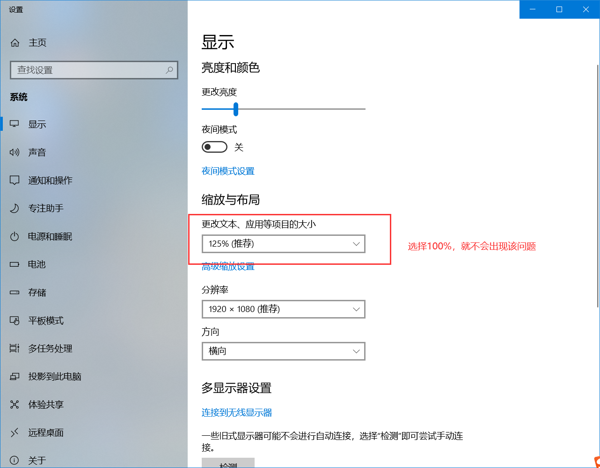

# 一、electron本身开发模式

##  1.1 npm init -y


  ***生成一个package.json


##  1.2 安装electron


  npm install electron --save-dev


  ***最好采用国内镜像


##  1.3 项目的根目录新建一个index.js


```
  const { app, BrowserWindow } = require('electron')


  const createWindow = () => {

​    const win = new BrowserWindow({

​      width: 800,

​      height: 600

​    })


​    win.loadFile('index.html')

  }


  app.whenReady().then(() => {

​    createWindow()

  })
```


##  1.4 启动项目==》设置命令 [package.json]


```
  "scripts": {

​      "start": "electron .",

​      "test": "echo \"Error: no test specified\" && exit 1"

​    },
```


##  1.5 启动项目


   npm run start


##  1.6 项目根目录新建一个index.html


# 二、我们的开发模式：electron + vite + vue3 


##  2.1 参考网址： https://evite.netlify.app/ 


##  2.2 安装步骤


  npx degit alex8088/electron-vite-boilerplate electron-app

  cd electron-app


  npm install

  npm run dev


# 三、安装路由


##  3.1 安装路由：npm install vue-router -S


##  3.2 新建：router/index.js


##  3.3router/index.js写入内容


```
  import { createRouter, createWebHashHistory } from "vue-router";

  export default createRouter({

   history: createWebHashHistory(),//hash模式

      routes:[{ path: "/", component: Login }]//路由配置规则数组

  })
```


##  3.4 main.ts中use一下router


  use(router)

# 四、electron-app项目，目录结构说明


 build ==》打包操作，例如：打包后的应用图标，.env环境变量的配置等等

 resources ==〉资料目录，例如：放入图片，有点类似于vue-cli中的publick目录

 src

  |main      ==>操作主进程内容，例如：创建窗口等

  |preload   ==>预加载，本身渲染进程是不可以使用electron等api的，通过preload预加载就可以使用了。

  |renderer  ==>操作渲染进程，就是应用中的内容。


 electron.vite.config.ts  ==》这个和vue中的vite.config.js ｜｜ vue.config.js类似


 ***其他目录文件随着课程的更新，会不断给大家讲述，包括打包项目时我们还会新增很多文件。


# 五、下载pinia 


##  5.1 官网：https://pinia.web3doc.top/


##  5.2  下载：npm install pinia -S


##  5.3 main.ts引入


```
  import { createPinia } from 'pinia'

  app.use(createPinia())
```


##  5.4 新建目录：store/index.js


```
  import { defineStore } from 'pinia'


  export const useStore = defineStore('storeId', {

​    state: () => {

​      return {

​        counter: 0,

​      }

​    },

​    getters:{},

​    actions:{}

  })
```


***关于pinia的二次封装和持久化存储，后续会讲述

## 5.5 持久化存储

安装：`cnpm install pinia-plugin-persist`

`main.ts`引入：

```
import { createPinia, defineStore } from "pinia";
import piniaPluginPersist from 'pinia-plugin-persist'
 
const store = createPinia()
store.use(piniaPluginPersist)
app.use(store)
```

`store/index.js`

```
import { defineStore } from 'pinia'

export const useStore = defineStore('storeId', {
  state: () => {
    return {
      counter: 0,
    }
  },
  getters: {},
  actions: {},
  persist: {
    enabled: true,
    strategies: [
      {
        storage: localStorage,//表示存储在localStorage
        paths:['counter']
      }
    ]
  }
})
```

使用：

```

```


# 六 配置代理和请求二次安装

安装：`cnpm install axios`

封装请求文件：

```
import axios from "axios";


const request = axios.create({
  baseURL: '/api'
});
// 添加请求拦截器
request.interceptors.request.use(function (config) {
  // 在发送请求之前做些什么
  return config;
}, function (error) {
  // 对请求错误做些什么
  return Promise.reject(error);
});

// 添加响应拦截器
request.interceptors.response.use(function (response) {
  // 对响应数据做点什么
  return response;
}, function (error) {
  // 对响应错误做点什么
  return Promise.reject(error);
});
```

`electron.vite.config.ts`

```
devServer:{
    proxy:{
      //简写
      '/api':{
        target:"http://uat.crm.xuexiluxian.cn",
        changeOrigin:true,
        rewrite:path => path.replace(/^\/api/,'')
      }
    }
  }
```

# 七 安装Element Plus

1 安装：`cnpm install element-plus --save`

element plus按需导入：

安装插件：`cnpm install -D unplugin-vue-components unplugin-auto-import`

electron.vite.config.js：

```
import AutoImport from 'unplugin-auto-import/vite'
import Components from 'unplugin-vue-components/vite'
import { ElementPlusResolver } from 'unplugin-vue-components/resolvers'

export default defineConfig({
  
  
  renderer: {
    
    plugins: [
      vue(),
      AutoImport({
        resolvers: [ElementPlusResolver()],
      }),
      Components({
        resolvers: [ElementPlusResolver()],
      }),
    ],
    
  }, 

})
```

2 安装icon图标：`cnpm install @element-plus/icons-vue`

全局导入：`main.ts`

```
import * as ElementPlusIconsVue from '@element-plus/icons-vue'

const app = createApp(App)
for (const [key, component] of Object.entries(ElementPlusIconsVue)) {
  app.component(key, component)
}
```

# 八 登陆布局&账号密码登陆功能


# 九 手机号码登陆


# 十 登陆页无边框窗口

1. 登陆页隐藏上方的electron（标题）

   在主进程里添加：`titleBarStyle:'hidden '`

   **出现问题**：窗口无法拖拽。

   解决：在渲染进程添加样式：`-webkit-app-region: drag;`但是也有个致命的问题：**设置了这个样式的元素几乎无法响应所有的鼠标事件，包括点击、拖拽等。**

2. 登陆页上方存在一个区域，该区域存放三个按钮，分别是放大、最小化、关闭窗口。该区域称为标题栏。隐藏标题栏：主进程里添加

   `frame:false`

3. 无边框窗口可以实现拖拽：

   在登陆页面添加事件`@mousedown=mousedown`

   ```
   const mousedown = (event) => {
   	dragging.value = true;
       mouseX.value = event.x;
       mouseY.value = event.y;
       document.onmousemove = (e) => {
       	if (dragging.value) {
               const x = e.screenX - mouseX.value
               const y = e.screenY - mouseY.value
               let data = {
                   appX:x,
                   appY:y
               }
               electron.ipcRenderer.invoke('custom-adsorption',data)
           }
       }
       document.onmouseup = () => {
       	dragging.value = false;
       }
   }
   ```

   主进程接收事件：

   ```
   ipcMain.handle('custom-adsorption',(event,res)=>{
   	let x = res.appX;
   	let y = res.appY;
   	mainWindow.setPosition(x,y)
   })
   ```

4. 设置窗口固定大小：`resizable:false;`

   解决问题：主进程设置`resizable:false;frame:false`后，拖拽窗口，窗口会自动变大。

   原因：

   

   或者：

   ```js
   app.commandLine.appendSwitch('high-dpi-support', 1);
   app.commandLine.appendSwitch('force-device-scale-factor', 1);
   ```

5. 拓展：创建一个子窗口，且仅可创建一个子窗口，子窗口实现锁定（固定位置）/解锁，关闭功能。重复点击创建子窗口，实现创建/关闭。

   - 创建子窗口

     渲染进程点击按钮触发主进程：

     ```
     <button @click="newList">歌词</button>
     const newList = () => {
       electron.ipcRenderer.invoke('new-list')
     }
     ```

     主进程判断是否有子窗口，**避免重复创建子窗口**

     ```js
       //创建子窗口
       ipcMain.handle('new-list',(event,res)=>{
         //当子窗口存在时，关闭窗口
         //当子窗口不存在时，创建窗口
         console.log('点击歌词')
         console.log(context.listWindow)
         if(context.listWindow != null){
           hideWindow()
         }else{
           createListWindow()
         }
       })
     
       
         //创建子窗口
       const createListWindow = () => {
         //创建
         context.listWindow = new BrowserWindow({
           width: 400,
           height: 100,
           show: false,
           titleBarStyle:'hidden',
           resizable:false,
           autoHideMenuBar: true,
           ...(process.platform === 'linux' ? { icon } : {}),
           webPreferences: {
             preload: join(__dirname, '../preload/index.js'),
             sandbox: false
           }
         })
         //显示
         context.listWindow.on('ready-to-show', () => {
           context.listWindow.show()
         })
         context.isShow = true;
         //关闭窗口
         context.listWindow.on('close', () => {
           //如果主进程退出，则销毁子窗口；如果主进程没有退出，则隐藏子窗口
           if(context.allowQuitting){
             context.listWindow = null;
           }else{
             hideWindow()
           }
         })
         //对应的页面
         if (is.dev && process.env['ELECTRON_RENDERER_URL']) {
           context.listWindow.loadURL(process.env['ELECTRON_RENDERER_URL']+'/#/list')
         } else {
           context.listWindow.loadFile(join(__dirname, '../renderer/index.html'))
         }
       }
     ```

     存在问题：首次点击按钮，此时`context.listWindow==null` ,成功走到创建窗口，再次点击按钮，此时`context.listWindow`是：

     ```
     BrowserWindow {
       setBounds: [Function (anonymous)],
       _events: [Object: null prototype] {
         blur: [Function (anonymous)],
         focus: [Function (anonymous)],
         show: [Function: visibilityChanged],
         hide: [Function: visibilityChanged],
         minimize: [Function: visibilityChanged],
         maximize: [Function: visibilityChanged],
         restore: [Function: visibilityChanged],
         'ready-to-show': [Function (anonymous)],
         close: [Function (anonymous)]
       },
       _eventsCount: 9,
       devToolsWebContents: [Getter]
     }
     ```

     则成功走到隐藏窗口。**但是当再次点击按钮时，此时`context.listWindow!==null`，仍然是：**

     ```
     BrowserWindow {
       setBounds: [Function (anonymous)],
       _events: [Object: null prototype] {
         blur: [Function (anonymous)],
         focus: [Function (anonymous)],
         show: [Function: visibilityChanged],
         hide: [Function: visibilityChanged],
         minimize: [Function: visibilityChanged],
         maximize: [Function: visibilityChanged],
         restore: [Function: visibilityChanged],
         'ready-to-show': [Function (anonymous)],
         close: [Function (anonymous)]
       },
       _eventsCount: 9,
       devToolsWebContents: [Getter]
     }
     ```

     所以还是走到了隐藏窗口。代码无法按预期实现，修改为：

     ```
       //创建子窗口
       ipcMain.handle('new-list',(event,res)=>{
         //首次点击按钮：创建窗口
         //再次点击按钮：根据‘context.isShow’判断是否显示，true就隐藏窗口，false就显示窗口
         if(context.listWindow === null){
           createListWindow()
         }else{
           if(context.isShow){
             hideWindow()
           }else{
             showWindow()
           }
         }
       })
     ```

     **子窗口y轴位置靠下：**

     ```
        import { app, shell, BrowserWindow,ipcMain,screen } from 'electron'
        //显示
         context.listWindow.on('ready-to-show', () => {
           let winHeight = screen.getPrimaryDisplay().bounds.height;
           context.listWindow.setBounds({
             y:winHeight-200
           })
           context.listWindow.show()
         })
     ```

     [electron](https://so.csdn.net/so/search?q=electron&spm=1001.2101.3001.7020)中screen模块：`screen.getPrimaryDisplay()`返回主窗口Display对象。

     ```
     console.log(screen.getPrimaryDisplay().bounds) // { x: 0, y: 0, width: 1920, height: 1080 }，获取页面的信息，height是整个窗口的高度
     ```

     置顶窗口：`alwaysOnTop:true`

     ```
         context.listWindow = new BrowserWindow({
           width: 400,
           height: 100,
           show: false,
           frame:false,
           resizable:false,
           autoHideMenuBar: true,
           alwaysOnTop:true,//置顶窗口
           transparent:true,//透明窗口
           ...(process.platform === 'linux' ? { icon } : {}),
           webPreferences: {
             preload: join(__dirname, '../preload/index.js'),
             sandbox: false
           }
         })
     ```

     子窗口实现拖拽：

     ```
     @mousedown="mousedown"
     
     import { ref } from 'vue'
     let dragging = ref<boolean>(false)
     let mouseX = ref<number>(0)
     let mouseY = ref<number>(0)
     const mousedown = (event) => {
       dragging.value = true;
       mouseX.value = event.x;
       mouseY.value = event.y;
       document.onmousemove = (e) => {
         if (dragging.value) {
           const x = e.screenX - mouseX.value
           const y = e.screenY - mouseY.value
           let data = {
             appX: x,
             appY: y
           }
           electron.ipcRenderer.invoke('list-adsorption', data)
         }
       }
       document.onmouseup = () => {
         dragging.value = false;
       }
     }
     ```

     **子窗口透明：**

     ```
     context.listWindow = new BrowserWindow({
           width: 400,
           height: 100,
           show: false,
           titleBarStyle:'hidden',
           resizable:false,
           autoHideMenuBar: true,
           alwaysOnTop:true,//置顶窗口
           transparent:true,//透明窗口
           ...(process.platform === 'linux' ? { icon } : {}),
           webPreferences: {
             preload: join(__dirname, '../preload/index.js'),
             sandbox: false
           }
         })
     ```

     **窗口锁定：**

     渲染进程：

     ```
     @click="kiosk"
     const kiosk = () => {
       electron.ipcRenderer.invoke('list-kiosk')
     }
     ```

     主进程：

     ```
       //锁定窗口
       ipcMain.handle('list-kiosk',(event)=>{
         if(context.listWindow.kiosk){
           context.listWindow.setKiosk(false)
         }else{
           context.listWindow.setKiosk(true)
         }
       })
     ```

     出现问题：锁定后的子窗口，会跳到电脑窗口的左上方。就算按照上方设定y轴靠下设置位置也无效。

     解决问题：主进程设置值isKiosk，为true时窗口锁定（拖拽时窗口不动）；为false时窗口解锁（拖拽时窗口进行移动）

     渲染进程：

     ```
     <span @click="kiosk">锁定/解锁</span>
     
     let isKiosk = ref<boolean>(false)
     const kiosk = () => {
       isKiosk.value = !isKiosk.value
       electron.ipcRenderer.invoke('list-kiosk', { isKiosk: isKiosk.value })
     }
     ```

     主进程：

     ```
       let isKiosk = false;
       //拖拽子窗口
       ipcMain.handle('list-adsorption',(event,res)=>{
         if(!isKiosk){
           context.listWindow.setPosition(res.appX,res.appY)
         }
       })
     
       //锁定窗口
       ipcMain.handle('list-kiosk',(event,res)=>{
         isKiosk = res.isKiosk
       })
     ```

     **窗口锁定时关闭按钮隐藏：**

     ```
     <button @click="close" :class="isKiosk ? 'off' : ''">关闭</button>
     .off {
       visibility: hidden;
     }
     ```

     **关闭子窗口：**

     渲染进程：

     ```
     const close = () => {
       electron.ipcRenderer.invoke('list-close')
     }
     ```

     主进程：

     ```
       //关闭子窗口
       ipcMain.handle('list-close',()=>{
         hideWindow()
       })
     ```

     **子窗口鼠标悬浮添加背景色，锁定子窗口时无论鼠标有没有悬浮都不给背景色：**

     ```
     let hoverColor = ref<string>('rgba(0,0,0,.5)')
     
     let isKiosk = ref<boolean>(false)
     const kiosk = () => {
       isKiosk.value = !isKiosk.value
       if (!isKiosk.value) {
         hoverColor.value = 'rgba(0,0,0,.5)'
       } else {
         hoverColor.value = ''
       }
       electron.ipcRenderer.invoke('list-kiosk', { isKiosk: isKiosk.value })
     }
     ```

     ```
     <div class="list" @mousedown="mousedown" :style="{ '--hover-color': hoverColor }">
     
     .list:hover {
       background-color: var(--hover-color);
     }
     ```

     频繁点击子窗口切换(显示/隐藏)，显示子窗口时会出现窗口抖动：

     ```
     app.commandLine.appendSwitch('wm-window-animations-disabled');
     ```

# 十一 登录页添加关闭/换肤/语言按钮


1. 关闭按钮

   ```
     //窗口关闭
     ipcMain.handle('closeWindow',()=>{
       mainWindow.close();
     })
   ```

2. 暗黑模式

   切换显示不同按钮。

   ```
   <el-button circle @click="configDark">
             <el-icon v-if="dark">
               <Sunny />
             </el-icon>
             <el-icon v-else>
               <Moon />
             </el-icon>
           </el-button>
   ```

   显示暗黑模式：

   ```
   //main.ts
   import 'element-plus/theme-chalk/src/dark/css-vars.scss'
   ```

   ```
   //assets/style.scss
   * {
     margin: 0;
     padding: 0;
   }
   
   a {
     text-decoration: none;
   }
   
   html.dark {
     /* 自定义深色背景颜色 */
     --el-bg-color: #626aef;
   
     .login {
       background: var(--el-bg-color);
   
       a {
         color: #fff;
       }
     }
   
   }
   
   ```

   ```
   //login.vue
   let dark = ref<string | null>(localStorage.getItem('dark'))
   //换肤
   const configDark = () => {
     const element = document.querySelector('html') as HTMLElement | null;
     if (element) {
       if (dark.value) {
         element.className = ''
       } else {
         element.className = 'dark'
       }
       dark.value = element.className
       localStorage.setItem('dark', element.className)
     }
   }
   ```


   ```
   const configDark = () => {
       const element = document.querySelector('html') as HTMLElement | null;
       if(element){
           element.className = 'dark'
       }
   }
   ```

   关闭窗口后再打开显示上一次的模式

   ```
   //App.vue
   import { ref, onBeforeMount } from 'vue';
   let dark = ref<string | null>(localStorage.getItem('dark'))
   onBeforeMount(() => {
     const element = document.querySelector('html') as HTMLElement | null;
     if (element) {
       if (dark.value) {
         element.className = 'dark'
       } else {
         element.className = ''
       }
     }
   })
   ```


3. 解决红色波浪线，如下图所示：

   

4. 解决函数里没使用的参数出现下划线问题：

   

   

# 十二 国际化

1. 安装插件：`cnpm i vue-i18n`

2. local/index.ts，

   - 在src目录下，创建 local 文件夹，并在下面分别创建三个文件 分别为 ：

   - ① index.js => 主文件用于导入 i18n ，和相关配置

     ```
     import { createI18n } from 'vue-i18n';
     import ZH from './lang/zh.js';
     import EN from './lang/en.js';
     
     import zhCn from 'element-plus/dist/locale/zh-cn.mjs'
     import English from 'element-plus/dist/locale/en.mjs'
     const messages = {
       'zh-cn': { el: zhCn, ...ZH  },
       'en': { el: English, ...EN  },
     };
      
     const i18n = createI18n({
       locale: localStroage.getItem('lang') || 'zh-cn',
       messages
     });
     
     export default i18n;
     ```

   - ② lang/zh.ts => 存放中文内容

     ```
     export default{
         login:{
             
         }
     }
     ```

   - ③ lang/en.ts => 存放英文内容

     ```
     export default{
         login:{
             
         }
     }
     ```

3. main.ts导入i18n

   ```
   import i18n from './local/index';
   app.use(i18n)
   ```


# 六、electron.vite.config.ts配置

```


  export default defineConfig({

​    main: {

​      ...

​    },

​    preload: {

​      ...

​    },

​    renderer: {

​      resolve: {

​        alias: {

​          ...

​        }

​      },

​      server:{

​        "proxy":{

​          "/api":{

​            target:'http://uat.crm.xuexiluxian.cn',

​            changeOrigin:true,

​            rewrite: path =>  path.replace(/^\/api/,'')

​          }

​        }

​      },

​      plugins: [

​        ...

​      ]

​    }

  })


```


# 七、打开调适


  窗口.webContents.openDevTools();

# 八、渲染进程 向 主进程通信


  渲染进程：

```
electron.ipcRenderer.invoke('名称',{ 传值 } )
```


  主进程：

```
   import { app, shell, BrowserWindow , ipcMain } from 'electron'

    ipcMain.handle('名称',(event,渲染进程向主进程传递的参数)=>{


    })
```

主进程无法打印中文的解决方法：

```
命令行输入以下命令：
chcp //得到了个936的默认值
chcp 65001
electron . --enable_logging
cnpm i electron -g //如果没有全局安装electron即执行该命令。再重新执行上述两个命令语句
```


```

```


